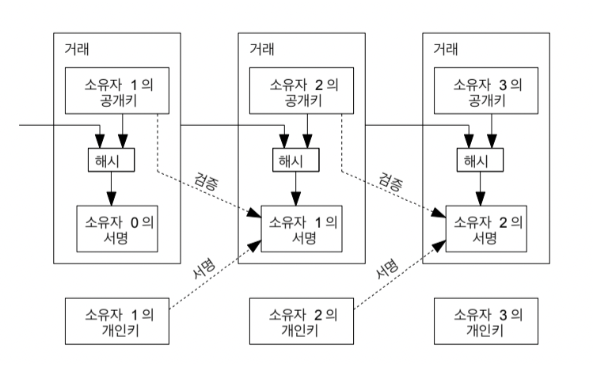
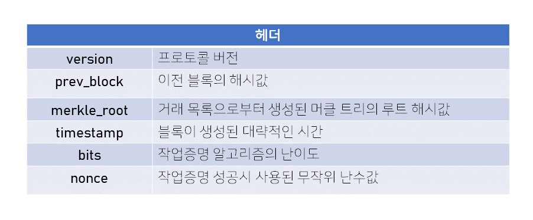

# 비트코인 백서 : Bitcoin: A Peer-to-Peer Electronic Cash System

> Satoshi Nakamoto의 논문 <비트코인 : 개인 대 개인의 전자화폐 시스템>을 공부한 내용을 정리해 보았다. [원문](https://bitcoin.org/bitcoin.pdf) / [한국어-번역본](https://bitcoin.org/files/bitcoin-paper/bitcoin_ko.pdf)

## 목차

[1. 서론](#1.-서론)
2. [거래 (Transaction)](#2.-거래-(Transaction))
[3. 타임스탬프 서버 (Timestamp Server)](#3.-타임스탬프-서버-(Timestamp-Server))
4. [작업증명 (Proof-of-Work)](#4.-작업증명-(Proof-of-Work))
5. [네트워크 (Network)](#5.-네트워크-(Network))
6. [인센티브 (Incentive)](#6.-인센티브-(Incentive))
7. [저장 공간 재확보 (Reclaiming Disk Space)](#7.-저장-공간-재확보-(Reclaiming-Disk-Space))
8. [](#)
9. [](#)
10. [](#)
11. [](#)
12. [](#)
13. [](#)

</br>

## 1. 서론

전자상거래의 문제점은 무엇일까. 바로 **이중 지불(double spenging)** 에 있다. 이에 우리는 신뢰할 수 있는 제3의 기관(중앙집권 기관)에 전적으로 의존하게 된다. 우리는 개인끼리 거래하는 상황에서 제3의 기관(ex. 은행)을 중간에 두고, 거래의 과정에서 분쟁이 발생하면 금융기관은 이를 중재해 줘야 한다. 이 때문에 완전히 철회 불가능(non-recersible)한 거래는 사실상 불가능하다. 즉, 중재로 인한 비용이 발생하고, 비효율이 생긴다는 것이다.

또한 이러한 중앙 집권적 시스템에는 비용 외에도 몇 가지 문제점이 더 있는데, 중심부에 부하나 공격이 집중되기 쉽고, 이러한 문제로 인해 시스템이 마비되는 경우 서비스 전체를 이용할 수 없게 된다는 것이다. 또 중심부 서비스 제공자가 의도적으로 서비스를 중단하거나 어떤 악의적인 일을 할 경우 막을 방법 또한 없다.

따라서 사토시는 '아무도 간섭 없이 사용할 수 있는 거래 구조를 만들자'는 목적을 가지고 **암호학적 증명**에 기반한 전자지불 시스템을 통해 신뢰할 수 있는 제3의 기관 없이 사람들 간의 직거래(P2P, Peer-to-Peer transaction)가 가능할 수 있는 시스템을 구상했다. 이것이 바로 비트코인의 탄생이다.

</br>

## 2. 거래 (Transaction)

_*'신뢰할 수 있는 제3의 기관이 없는데 개인 간의 거래를 어떻게 증명해?'*_

> 우리는 전자화폐(electronic coin)를 전자서명의 체인으로 정의한다고 했다. 각 소유자는 이전 거래와 다음 소유자의 공개키(public key)에 대한 해시에 전자서명을 한 것을 마지막에 추가하여 코인을 전달한다. 수취인은 소유권의 체인을 검증하고 싶다면 이 전자서명들을 검증하면 된다.

설명만 읽으면 어렵다. 이것을 이해하기 위해선 먼저 공개키(public key)와 개인키(private key)에 대해 이해해야 한다.

- 공개키 (public key) : 모든 사람들이 알 수 있는 값. (ex. 주소, 계좌번호, 이메일 등)
- 개인키 (private key) : 나만 알 수 있는 값. 이걸 통해 전자 서명을 할 수 있다. (ex. 비밀번호)

예를 들어보자. A가 B에게 돈을 보내고 싶다고 가정한다. 이때 만들어지는 블록에는 1. B의 공개키 2. A가 보내고자 하는 돈을 가지게 된 거래(즉, 이전 거래)를 hash 한 값 3. A의 전자 서명(개인키)
의 정보가 들어간다. 수취인 B는 A의 전자 서명(개인키)과 A의 공개키를 통해 진짜 A가 보낸 것인지 검증이 가능하다.

<details>
<summary>공개키 암호 방식(Public-key cryptography)에 대한 설명 [클릭]</summary>
<div markdown="1">

위의 예제에서 수취인 B는 어떻게 A의 private key와 A의 public key를 통해 진짜 A가 보낸 것인지 검증이 가능한 걸까? 이는 공개키 암호 방식으로 public key로 암호화(encrypt)를 하면 private key로 복호화(decrypt)가 가능한 방법이다. 즉, 기존의 대칭/단일키 암호 시스템에서 암호화와 복호화에 쓰이는 key가 동일하여 발생하는 보안상의 문제점을 극복하기 위해 등장한 방법이다. </br>
이때 private key가 있으면 public key는 바로 얻을 수 있다. 하지만 public key를 가지고 private key를 알아내는 것은 사실상 불가능하다.
</br>

- 공개키 암호 시스템의 예
  1. 암호화 : public key로 encrypt, private key로 decrypt
     Ex. A가 B에게 암호화된 문서를 보내고 싶다. 1. A가 문서를 B의 공개키로 암호화해서 보낸다. (공개키는 말 그대로 공개되어 있으니까 상대의 공개키 또한 문제없이 사용이 가능하다.) 2. B는 문서를 받아서 자신의 비밀키로 복호화한다. 이는 즉, B만 열어볼 수 있는 문서인 셈이다. </br>
     이는 실제 이메일 시스템에서도 쓰이는 방식이다.
  2. 전자 서명 : private key로 encrypt, public key로 decrypt
     Ex. A가 해당 문서를 자신이 작성했음을 증명하고 싶다. 1. A가 문서를 자신의 비밀키로 서명한다. 2. 누구나 A의 공개키로 검증(verification)이 가능하다. </br>
     이는 비트코인이나 여러 암호화폐의 핵심 기술이다.
     </br>

대칭키 암호 방식 대신 공개키 암호 방식을 선택하는 이유에 대해 공개키 방식이 대칭키에 비해 매우 뛰어난 보안성을 자랑하는 이유도 있지만 효율적인 측면 또한 무시할 수 없다. 예를 들어보자. 1000명의 user가 암호화 통신/거래를 할 예정이다. 이때 필요한 key의 개수를 구해보자.
</br>

- 대칭키의 경우 : 이 거래에서 나는 다른 999명과 거래할 수 있다. 이는 다른 누군가도 나를 포함한 999명과 거래할 수 있다는 뜻이다. 즉, 조합의 문제이다. 총 1000 Combination 2 = 499500 개의 key가 필요하다는 뜻이다. 또한 나는 거래를 위해 타인의 key 999개를 기억해야 한다. </br>
- 공개키의 경우 : public key, private key가 각각 사람 수만큼만 있으면 된다. 여기서 나는 private key 단 하나만 기억하고 있으면 된다.

</div>
</details>

</img><br/>

그림을 보면 쉽게 이해가 가능하겠지만 결국 2번에서 input 되는 '이전 거래를 hash 한 값'은 현재 거래의 hash 값에 포함되고, 이 거래 또한 후에 hash 되어 다른 거래에 input 될 것이다. 즉, 이 블록(거래)들은 결국 체인의 형태로 이어져 있다. 말 그대로 '**블록체인**'인 것이다.

하지만 여기엔 문제가 있다. 수취인 B는 이전 소유자들이 **이중 지불(double spending)** 을 했는지는 검증할 수 없다. 이중 지불이란 원본 파일에 저장된 가치를 지불한 뒤, 해당 파일을 복사하여 다른 사람에게 또 지불하는 것을 말한다. 전자상거래의 큰 문제점 중 하나이다. 이 문제는 기존에 통상적으로 신뢰할 수 있는 금융기관이나 조폐국(mint)을 도입하여 그들이 모든 거래에 대해 이중 지불을 검사하도록 하는 것이었다.

그러나 P2P 거래를 하는 비트코인은 어떻게 해결해야 할까? 이에 대해 사토시는

```
1.  모든 거래는 반드시 공개적으로 알려져야 한다.
2.  참가자들이 거래의 순서에 대한 단일 기록에 동의할 수 있는 시스템이 필요하다.
```

고 했다. 이 시스템이 바로 타임스탬프(Timestamp)이다.

</br>

## 3. 타임스탬프 서버 (Timestamp Server)

이중 거래(=이중 지불)의 문제점의 핵심은 거래의 '순서'이다. 이에 우리는 각 거래에 타임스탬프를 찍어 이를 비교하여 어떤 것이 먼저 실행된 거래인지(유효한 거래인지) 증명할 수 있다.

예를 들어보자. 일단 같은 기기에 담긴 지갑에서는 이중거래가 불가능하다. 지갑의 잔액이 만원일 때 여기서 만원을 지불하는 순간 잔액은 0이 되기 때문에 다시 만원을 지불할 수 없기 때문이다. 따라서 이중 거래는 물리적으로 떨어진 두 개의 지검에서 발생할 수 있는 문제이다.
장부는 복제되어 있으므로 한국에서도 내 잔액은 만원이고, 캐나다에서도 만원이 있다. 그렇다면 한국과 캐나다에서 각각 만원을 보내면 어떻게 될까? 이중 지불이 발생했지만 두 거래는 블록체인 네트워크를 타고 전파되다가 어디에선가 반드시 만나게 되어있다. 그 지점에서는 두 거래 사이의 선후관계가 분명히 존재할 것이다.

블록 안에는 여러 개의 거래 내역이 담겨있는데, 이 블록을 해시한다. 이때 해시 값이 만들어지는 시점이 타입스탬프가 된다. 그리고 이 타임프탬프는 신문처럼 사람들이 모두 볼 수 있는 곳에 널리 공표된다. 이로써 그 시간에 검증 가능한 거래가 존재했다는 것을 명백히 입증할 수 있고(존재 증명), 그 이후 데이터 간의 전후 관계를 논리적으로 부정할 수 없게 만든다. (내용 증명, 해시 값에 타임스탬프가 포함되기 때문)

하지만 이러한 타임스탬프에는 동기화의 문제가 있다. 신뢰할 수 있는 제3자가 공증하는 거래가 아닌 모두가 동등한 P2P 거래 환경에서는 시간 동기화를 완벽하게 할 수 없다. 말 그대로 모두가 동등하기 때문에 누구의 시간을 기준으로 한다는 것 자체에 문제가 있기 때문이다. 즉, 거래자들 간의 시간이 다를 때 누구의 시간이 옳고 그르다고 말할 수 없다는 것이다. 그렇다면 임의의 어떤 서버의 시간을 기준으로 정하고 거래를 하면 되지 않을까? 이렇게 되는 순간 이미 그 서버에 의존하게 되기 대문에 진정한 P2P 환경이 아니게 된다.

<details>
<summary>타임스탬프에서 발생하는 동기화의 오류에 대해 비트코인 위키에서는 아래와 같이 다룬다고 되어있다. [클릭]</summary>
<div markdown="1">
A timestamp is accepted as valid if it is greater than the median timestamp of previous 11 blocks, and less than the network-adjusted time + 2 hours. "Network-adjusted time" is the median of the timestamps returned by all nodes connected to you. As a result, block timestamps are not exactly accurate, and they do not even need to be in order. Block times are accurate only to within an hour or two.
</div>
</details>

어쨌든 핵심은 타임스탬프가 존재 증명과 내용 증명을 해주기는 하지만 이중 지불의 문제를 완벽히 해결해주지는 못한다는 점이다. 이를 해결하기 위한 방법이 바로 다음장의 **작업증명(Proof-of-Work)** 이다.

</br>

## 4. 작업증명 (Proof-of-Work)

> 다수결에 의한 결정은 가장 긴 체인으로 나타내어지며 이는 가장 많은 작업증명 노력이 들어간 체인이다. 과반수의 컴퓨팅 파워가 정직한 노드에 의해 제어된다면 정직한 체인이 가장 빨리 길어져 다른 경쟁 체인들을 앞서게 될 것이다. 이전의 한 블록을 수정하기 위해서는, 공격자는 해당 블록과 그 이후의 모든 블록들의 작업증명을 다시 해야 하고 또 정직한 노드들의 작업을 따라잡고 추월해야 한다. 우리는 뒤에서 느린 공격자가 따라잡을 확률이 블록들이 더해짐에 따라 지수적으로 감소함을 보일 것이다.

일반인들에게 있어 비트코인하면 떠오르는 것은 단연 그래픽 카드를 통한 '채굴' 대란일 것이다. 여기서 말하는 코인을 채굴한다는 것이 바로 '작업증명'이다.

**Proof Of Work**, 작업을 통해 증명을 한다는 뜻이다. 여기서 말하는 '작업'이란 해시값을 구하는 것을 말한다. 즉, 우리가 블록을 블록체인에 올리고 싶다면 해시값을 찾는 일종의 문제를 풀어야 하는 과정을 거쳐야 하는 것이고, 이 과정을 거쳐서 블록이 확정 상태가 되었다면 블록에 있는 거래는 **_믿을 수 있는 것_**이 된다.

해시 함수(hash function)는 입력 길이에 상관없이 정해진 길이의 결과를 내어주는 함수이다. 작업 증명에서 가장 많이 채택되어 사용되고 있는 SHA(Secure Hash Algorithm)-256의 경우 입력 길이에 상관없이 항상 256bit의 결과를 준다. 또 다른 중요한 특징으로는 입력값을 통해 결괏값을 알아낼 수 있어도, 결괏값을 통해 입력값을 찾아낼 수는 없다. 이는 마치 사과를 믹서기에 넣어 사과 주스를 만들 수는 있어도 사과 주스로 사과를 만들 수는 없는 것과 같다.

블록체인의 모든 블록은 **헤더**와 거래 목록으로 구성되어 있다. 우리는 80바이트의 헤더를 해시 함수인 SHA-256에 넣어 32바이트의 값을 구한다. 그리고 이렇게 구해진 32바이트 값을 한번 더 SHA-256 함수에 집어넣어 최종 해시 값을 구한다. 이 값이 **난이도 목표보다 작다면** 유효한 해시값으로 작업증명에 성공한 것이다. 헤더는 아래와 같이 구성되어있다.

</img><br/>

헤더 안의 값 중 version, prev_block, merkle_root, timestamp, bits는 이미 결정되어 있는 값이다. 하지만 nonce는 정해져 있지 않으며, 0부터 2^32 범위의 무작위 난수이다. 그럼 난이도 목표보다 작은 헤더 값을 만들기 위해 우리가 조작할 수 있는 값은 nonce 뿐이다. 즉, 채굴자는 이 nonce 값을 하나씩 바꿔가며 직접 연산을 해보아야 한다. 무려 0부터 2^32 범위의 값을 변화시켜가며 말이다. 그리고 그 값이 앞서 말한 대로 난이도 목표보다 작은 값이 나왔다면 작업증명에 성공한 것이고, 그 보상으로 비트코인을 얻을 수 있는 것이다.

전 세계의 채굴자들은 지금도 경쟁하며 채굴을 한다. 만약 누군가 유효한 nonce 값을 찾았다면 이는 10초 이내로 빠르게 전파될 것이다. 새로운 블록을 전파받은 이웃 노드들은 해당 블록의 **유효성 검증**을 한다. 유효성 검증이란 새로 찾은 nonce 값으로 해시값을 구했을 때 정말 난이도 이하의 값을 도출하는지를 검정하는 것이다. 이는 해시 함수를 두 번만 돌려보면 검증이 가능하기 때문에 검증은 매우 빠르게 이루어진다. 이게 작업증명의 핵심이다. 유효한 nonce를 찾는 것은 매우 어렵지만, 이를 검증하는 것은 매우 쉽다는 것이다.

그럼 유효한 해시값의 기준이 되는 **난이도 이하의 값**이라는 건 어떻게 정하는 걸까? 먼저 작업증명을 통해 새로운 블록을 생성하기 위해서는 (비트코인의 기준으로) 평균 10분의 연산력을 투입해야 하는 것이 보장되어 있다. 여기서 말하는 연산력이라는 것은 결국 앞서 설명한 유효한 해시값을 찾는 과정을 말한다. 이 난이도는 매 2016번째 블록마다 조정된다. 만약 2016개의 블록을 생성하는데 20160분 이상이 걸렸다면 난이도를 조금 하락시키고, 반대로 그 이하로 걸렸다면 난이도를 상승하는 식으로 말이다.

이러한 PoW 알고리즘은 어쩌다 등장하게 되었을까? 이는 블록체인에서 블록이 생성되는 과정에서 각 노드들은 서로를 신뢰할 수 없으며, 악의를 가진 노드가 장부를 오염시킬 수 있기 때문이다. 이는 **비잔틴 장군 문제**로 비트코인의 등장 이전 수많은 가상화폐가 이 문제를 해결하지 못하여 생성과 소멸을 반복했었다.

<details>
<summary>비잔틴 장군 문제에 대한 설명 [클릭]</summary>
<div markdown="1">
실제 비잔티움 제국에서 발생한 일은 아니며, 1982년 컴퓨터 공학자인 래슬리 램포트와 쇼스탁, 피스가 공저한 논문에서 사용된 표현이다. 
지리적으로 떨어져 있는 비잔틴의 장군들이 하나의 도시를 함락시키기 위해 공격 방법을 합의하는 것에 대한 문제로, 장군들이 모두 한날한시에 합심하여 공격을 가해야만 도시를 함락시킬 수 있다. 그리고 이를 위해 언제 어떻게 공격을 할지 장군들은 합의해야만 한다. 가정된 상황은 다음과 같다.

- 장군들의 과반수 이상이 출병해야만 승리할 수 있다.
- 각 장군들은 전령을 통해서만 연락을 주고받는다.
- 전령은 전달 도중 훼손, 조작될 수 있다.
- 장군들 중에는 배신자가 존재할 수 있으며, 배신자는 작전에 혼선을 줄 수 있다.

결국 장군들은 합심을 해야 함과 동시에 서로 신뢰할 수 없는 딜레마에 빠진다.
즉, '서로 신뢰하지 못하는 사람들 사이에서도 하나의 합의점에 도달할 수 있을까?'가 이 문제의 핵심이다.

</div>
</details>

**_다수결에 의한 결정은 가장 긴 체인으로 나타내어지며 이는 가장 많은 작업증명 노력이 들어간 체인이다. 과반수의 컴퓨팅 파워가 정직한 노드에 의해 제어된다면 정직한 체인이 가장 빨리 길어져 다른 경쟁 체인들을 앞서게 될 것이다._**

블록체인은 누구에게나 열려있는 시스템이다. 따라서 악의를 가진 노드(비잔틴 노드)가 네트워크에 참여하더라도 문제없이 작동해야 한다. 이것이 바로 **비잔틴 장애 허용**이다. 비트코인은 PoW 알고리즘을 통해 **정직한 체인이 가장 빨리 길어진다**는 것을 확인했고, 또한 악의적으로 조작한 체인이 이를 따라잡는 것은 사실상 불가능하다는 것을 알았다. (블록당 평균 10분의 연산력이 필요하기 때문에) 결국 PoW 알고리즘은 보상을 목적으로 채굴에 자발적으로 참여한 채굴자들에 의해 저절로 보안까지 이뤄지는 구조이다.

</br>

## 5. 네트워크 (Network)

> 네트워크를 실행하는 단계는 다음과 같다.
>
> 1.  새로운 거래가 모든 노드에 브로드캐스트 된다.
> 2.  각 노드가 새로운 거래를 블록에 수집한다.
> 3.  각 노드가 그 블록에 맞는 난도의 작업증명을 찾아 나선다.
> 4.  노드가 작업증명을 찾은 시점에, 거기서 모든 노드로 그 블록을 브로드캐스트 한다.
> 5.  노드는 모든 거래가 유효하며 아직 지불되지 않았다는 조건에 맞을 경우에만 그 블록을 승인한다.
> 6.  노드는 블록 승인을 표현하기 위해 먼젓번 해시로 승인된 블록의 해시를 사용해 사슬 안에 다음 블록을 생성한다.

#### 블록체인의 분기

우리는 이런 의문을 가질 수 있다. 만약 서로 다른 두 채굴자가 동시에 nonce 값을 구해서 각각 다른 새로운 블록을 추가한 체인을 확산시켜서 분기점을 만들면 어쩌지? 앞서 작업 증명에서 봤듯이 우리는 더 많은 작업 증명이 수행되어 더욱 긴 블록을 가진 체인을 선택할 것이다.

사실 작업 증명은 평균 10분이 소요될 정도로 연산량이 큰 작업이기 때문에 이렇게 분기점이 생길 확률은 낮다. 그리고 머지않아 각 체인의 길이가 달라지기 때문에 분기에 의한 충돌 해소 시점도 금방 온다. 통계에 따르면 대부분 2개 이하, 최대 3개 이내에서 분기에 의한 충돌이 해소됨을 알 수 있다.

하지만 매우 낮은 확률일지라도 분기 상태는 언제든지 일어날 수 있기 때문에 실제 거래에서는 보통 어떤 거래가 포함된 블록 이후로 3~5개의 블록이 더 추가된 후에 그 거래를 최종적으로 확정한다.

그렇다면 이어서 드는 의문점이 있다. 분기에 의한 충돌 해소 시점에서 더 짧은 체인에 달린 블록은 연결이 끊어지고 고아가 될 텐데, 여기서 유실되는 거래는 없을까? 만약 버려진 고아 블록 안에 있던 거래 정보가 살아남은 쪽 블록에는 아직 없었다고 치자. (참고로 각 노드가 블록에 담은 거래의 순서는 물리적 거리에 따라 다를 수 있다.)

네트워크를 실행하는 단계의 첫 번째를 보면 새로운 거래가 모든 노드에 브로드캐스트 된다고 되어있다. 그러니까, 당장은 체인에 추가되어 있는 블록에는 없을지라도 블록 생성 작업이 시작되지 않은 후보 블록 어딘가에는 그 거래가 분명히 담겨있을 것이다. 그리고 언젠가는 작업 증명을 마치고 체인에 블록이 추가될 것이다.

</br>

## 6. 인센티브 (Incentive)
> 블록의 첫 거래는 해당 블록을 생성한 사람이 소유하게 되는 신규 코인을 생성하는 특별한 거래가 된다. 이는 노드들에게 네트워크를 유지할 인 센티브(incentive)를 제공하고, 코인들을 발행할 중앙 기관이 없기 때문에, 코인들이 최초로 유통(circulation)될 방법을 제공한다. </br>
> 인센티브는 거래 수수 료로도 제공될 수 있다. 거래의 결과 값이 입력값보다 작다면 그 차이가 해당 거래를 포함하는 블록에 인센티브 값으로 추가되는 거래 수수료인 것이다. 미리 정해 진 수량의 코인이 모두 발행되고 나면 인센티브는 거래 수수료 체제로 전환되고 인플레이션으로부터 자유로워(inflation free) 진다. </br>
> 이 인 센티브는 노드들이 정직함을 유지하는 것을 도와줄 수 있다. 

</br>

## 7. 저장 공간 재확보 (Reclaiming Disk Space)
