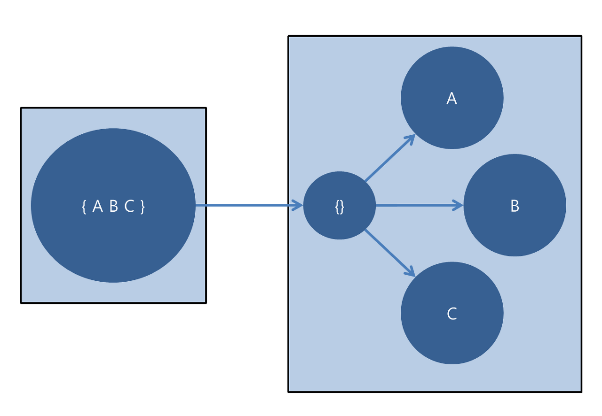
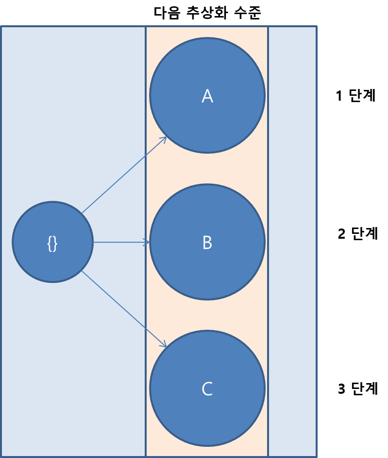
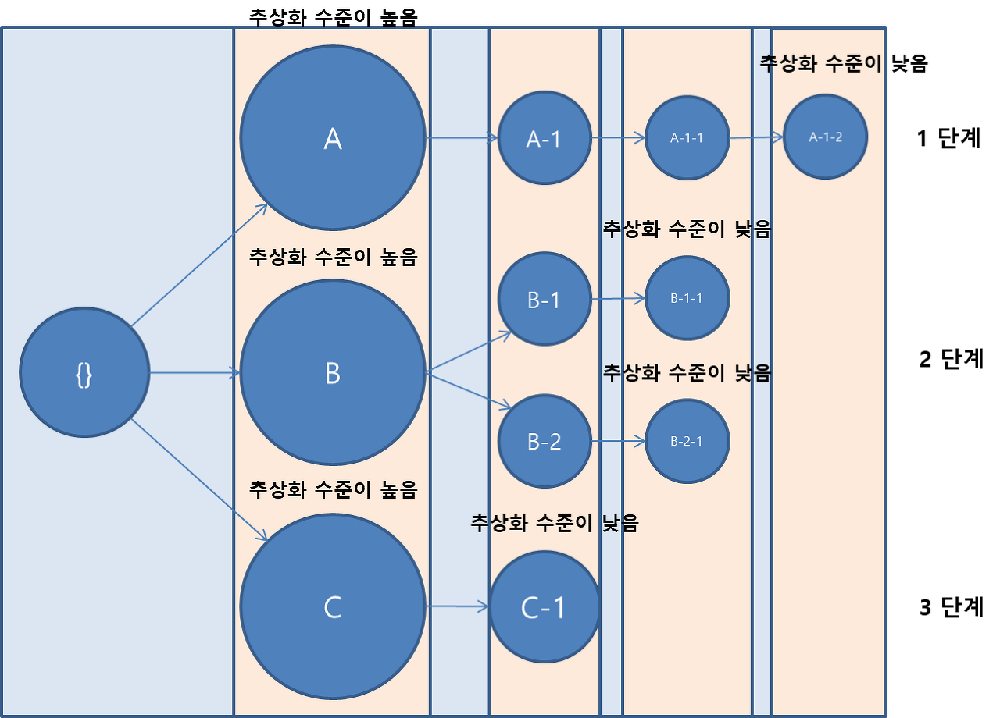
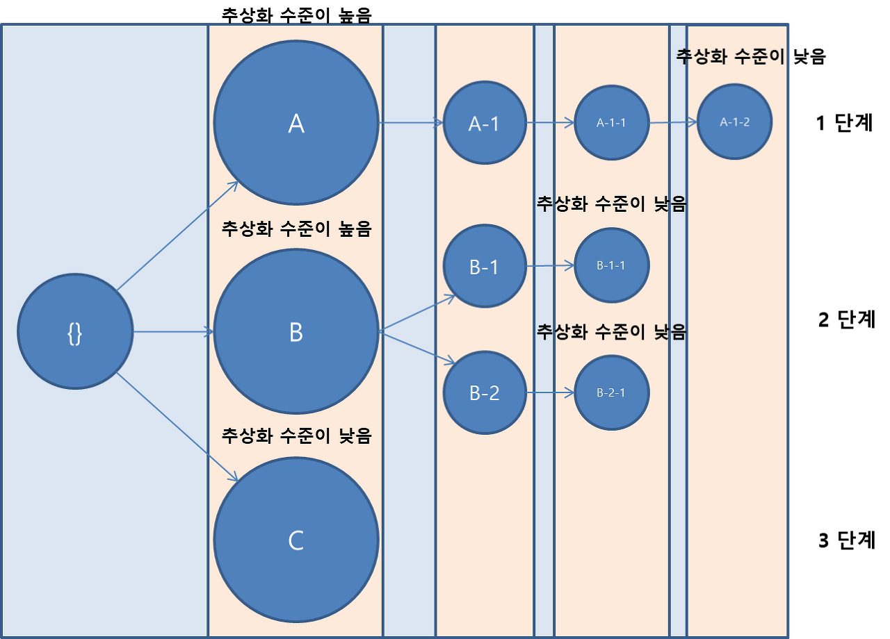
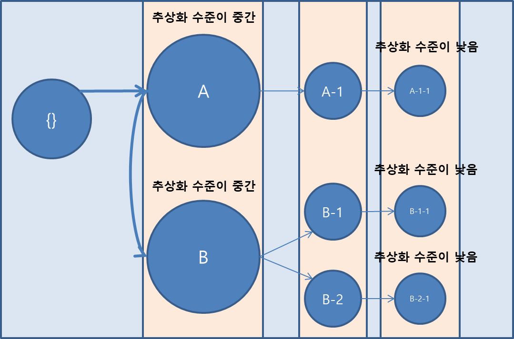
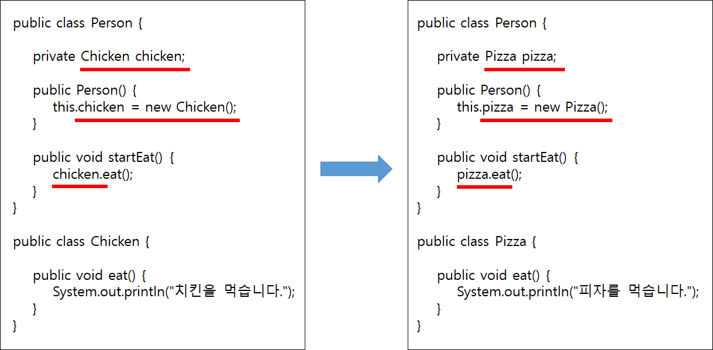
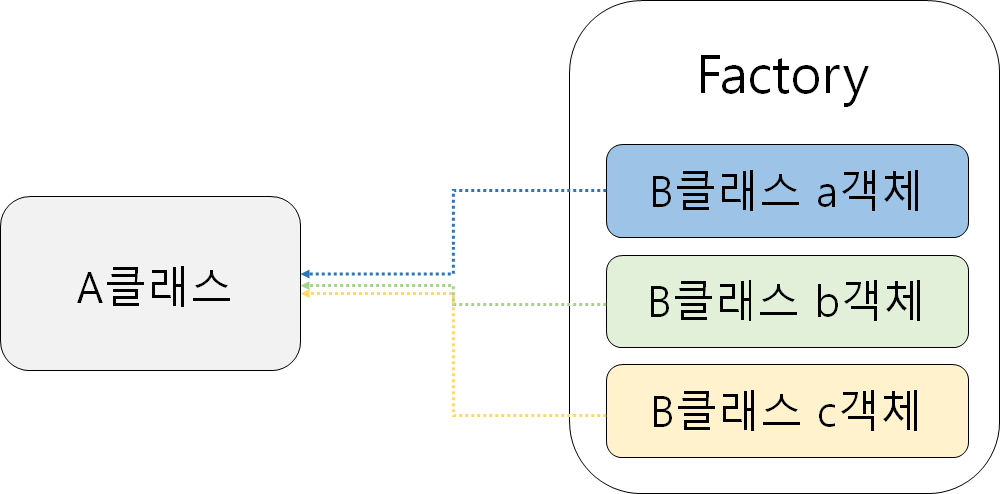

# 3장 함수

> clean code 3장 리뷰

</br>

## 1. 작게 만들어라

> 함수를 만드는 첫째 규칙은 '작게!'다. 함수를 만드는 둘째 규칙은 '더 작게!'다. (p.42)

이는 무조건 작다고 좋다는 뜻이 아니라, 불필요하게 큰 함수가 만들어지지 않도록 주의해야 한다는 뜻이다. 그리고 불필요하게 큰 함수는 하나의 함수가 여러 가지 일을 하는 것을 의미한다.

</br>

## 2. 한 가지만 해라

> 함수는 한 가지를 해야 한다. 그 한 가지를 잘해야 한다. 그 한 가지만을 해야 한다. (p.44)

한 가지 일(기능)이라는 게 매우 주관적이다. 내가 생각하기에 '설거지'도 한 가지 일이라고 생각되지만 누군가는 '퐁퐁을 짜는 일', '수세미를 문지르는 일', '그릇을 물에 씻는 일' 같은 것이 한 가지 일이라고 생각한다. </br>
따라서 한 가지 일을 판단하는 어느 정도의 기준이 필요하다. 저자는 그 기준을 다음과 같이 정의한다.

```
- 의미 있는 다른 이름으로 다른 함수를 추출할 수 있다면 그 함수는 여러 작업을 하고 있는 것이다.
- 하나의 함수 아래에는 추상화 수준이 하나인 단계만 수행해야 한다.
```

</br>

## 3. 함수 당 추상화 수준은 하나로

> 한 함수 내에 추상화 수준을 섞으면 코드를 읽는 사람이 헷갈린다. 특정 표현이 근본 개념인지 세부사항인지 구분하기 어려운 탓이다. 또한 이것이 뒤섞이기 시작하면 사람들이 함수에 세부사항을 점점 더 추가한다. (p.45)

### 추상화 수준 이란?

</img><br/>

왼쪽의 {A, B, C} 기능을 하는 **큰 개념**을 분해하여 A, B, C를 만들었다. 그리고 나눠진 3개의 기능을 **단계 별로 수행**하는 {}를 만들고 연결시켜 줬다. 결국 A, B, C가 하나의 **추상화 수준**이 된 것이다.

</img><br/>

그렇다면 코드 3-3을 보자

```java
public static String renderPageWithSetupsAndTeardowns(PageData pageData, boolean isSuite) throws Exception {
	if(isTestPage(pageData)){
    		includeSetupAndTeardownPages(pageData, isSuite);
    	}
	return pageData.getHtml();
}
```

이 코드는 한 가지만 하는가? 아니면 세 가지를 하는가? </br>
기능으로만 따지면 1. 테스트 페이지인지 확인, 2. 설정 페이지와 해제 페이지를 넣음, 3. HTML 렌더링 이렇게 세 가지로 분류 가능하다. </br>
이런 상황에서 **추상화 수준**으로 확인이 가능하다. 지정된 함수 이름 아래에서 추상화 수준이 하나인 단계만 수행한다면 그 함수는 한 가지 작업만 한다. </br>

> 어쨌거나 함수를 만드는 이유는 **큰 개념**을 다음 **추상화 수준**에서 **여러 단계**로 나눠 **수행**하기 위해서가 아니던가. (p.45)

### '추상화 수준이 같다'는 것은?

저자는 책에서 추상화 수준에 대해 논할 때 높음, 중간, 낮음으로 분류한다. 46Page에서 한 함수 다음에는 추상화 수준이 한 단계 낮은 함수가 온다고 했다. 함수의 추상화 수준은 다음 단계로 갈수록 낮아진다. 그리고 **이 수준이 같아야 함수가 하나의 일을 한다고 할 수 있다.**

</img><br/>

</img><br/>

추상화 수준이 중간이라는 것은 같은 추상화 수준을 가진 함수끼리의 연관을 말한다. 저자는 추상화 수준이 중간인 것은 지양하라고 한다. 이는 강한 결합 때문이다.

</img><br/>

### 내려가기 규칙

    - 위에서 아래로 이야기처럼 읽혀야 좋다.
    - 추상화 수준이 높은 함수는 위에, 추상화 수준이 낮은 함수는 아래에 작성해야 한다.

</br>

## 4. Switch 문

> switch 문은 작게 만들기 어렵고, '한 가지' 작업만 하는 switch 문도 만들기 어렵다. 본질적으로 switch 문은 N가지를 처리한다. (p.47)

```java
public Money calculatePay(Employee e) throws InvalidEmployeeType {
	switch (e.type) {
		case COMMISSIONED:
			return calculateCommissionedPay(e);
		case HOURLY:
			return calculateHourlyPay(e);
		case SALARIED:
			return calculateSalariedPay(e);
		default:
			throw new InvalidEmployeeType(e.type);
	}
}
```

위 코드는 직원 유형에 따라 다른 값을 계산해 반환하는 함수다. 저자는 위 함수에 몇 가지 문제가 있다고 한다.

첫째, 새 직원의 유형이 추가될 때마다 코드가 더 길어질 것이다. </br>
둘째, '한 가지' 작업만 수행하지 않는다. </br>
셋째 SRP(단일 책임 원칙)를 위반한다. 코드를 변경할 이유가 여럿이기 때문이다. </br>
넷째, OCP(개방 폐쇄 원칙)를 위반한다. 새 직원 유형을 추가할 때마다 코드를 변경하기 때문이다. </br>
마지막으로 위 함수와 동일한 구조의 함수가 무한정 존재할 수 있다는 사실이다. </br>

- **Q.** 여기서 저자가 말하는 두 번째의 '한 가지' 작업만 수행하지 않는다는 문제는 어째서인가? 모든 case에서 동일한 추상화 수준으로 기능을 수행하는데, 어째서 '한 가지' 작업만 수행하지 않는다는 것인가. 여기서 문제(직급별 월급 계산)를 더 쪼갤 수 있는 것도 아닌데 말이다.

- **Q.** 같은 맥락으로 세 번째의 SRP(단일 책임 원칙)을 어째서 위반하는 것인가? 저자는 case 별로 다 다른 계산 법이 존재하고 이는 클래스 변경 이유는 오직 하나여야 한다는 SRP(단일 책임 원칙)에 어긋난다고 한다. 하지만 case에 있는 함수들은 이미 추상화 수준이 높다. 즉 어떤 직급의 월급 계산법이 변경된다 하더라도 그건 각각의 함수에서 수정되면 될 일이다. calculatePay에서는 변경될 사항이 없어 보인다.

어쨌든, 이 코드의 가장 크고 명백한 문제는 월급 계산 작업 외에도 직종별로 이러한 분류가 필요한 작업이 있다는 점이다.

예를 들면 직종별 휴가일수 계산이나 월급일 같은 함수 말이다. 매번 같은 구조의 switch 문을 반복적으로 작성해야 한다.

만약 직종이 하나 더 추가된다면? 모든 switch 문에 case를 하나씩 더 추가해줘야 한다. 이처럼 확장 시 많은 유지보수를 요구하는 코드는 적절한 '분리'가 이루어지지 않은 코드이고, 이는 **OCP(개방 폐쇄 원칙)** 에 어긋난다.

### 다형성과 switch 문

다형성(polymorphism)이란 하나의 객체가 여러 가지 타입을 가질 수 있는 것을 의미한다. 예제의 Employee는 다형성 있는 클래스이다. 임원, 사원, 아르바이트 등 다양한 형태를 가질 수 있기 때문이다. 이런 **다형적 객체를 생성할 때** switch 문을 사용하면 좋다.

객체의 생성 작업은 **객체 생성 전용 클래스**로 분리시키면 유지보수에 좋다. 만약 객체 생성 전용 클래스 없이 A클래스 안에서 B클래스의 객체를 생성하면 두 클래스는 **강한 결합**을 한다. 강한 결합의 상태에서 B클래스에 변화를 주면 A클래스의 코드도 같이 고쳐야 한다.

</img><br/>

이런 코드가 바로 강한 결합의 예시이다. 따라서 우리는 객채 생성 작업을 담당할 클래스를 따로 만들어 줄 것이다. 보통 이를 **팩토리(Factory)** 라고 부른다.

</img><br/>

**팩토리는 B클래스의 객체를 생성한 후 A클래스에게 공급**하는 방식으로 작동한다. 이처럼 객체의 생성 권한이 다른 클래스로 넘어간 것을 **제어의 역전(IOC)** 이라고 부른다. </br>
이런 제어의 역전 상황에서 switch 문은 좋은 효과를 발휘한다. **상황에 따라 적절한 객체를 공급해줄 수 있기 때문**이다. </br>

```java
public abstract class Employee {
	public abstract boolean isPayday();
	public abstract Money calculatePay();
	public abstract void deliverPay(Money pay);
}
```

Employee 추상 클래스는 CommissionedEmployee 클래스, SalariedEmployee 클래스, HourlyEmployee 클래스를 자식 클래스로 갖는다.(Override) 그러므로 Employee 추상 클래스는 3가지 형태로 구현 가능하다.(다형성)

```java
public interface EmployeeFactory {
	public Employee makeEmployee(EmployeeRecord r) throws InvalidEmployeeType;
}
```

위와 같이 EmployeeFactory 인터페이스를 만들어 makeEmployee() 추상 메소드를 선언하여 구현체를 따로 둘 수 있다.이는 약한 결합을 이루게 해 줘 유지보수를 용이하게 해 준다.

```java
public class EmployeeFactoryImpl implements EmployeeFactory {
	public Employee makeEmployee(EmployeeRecord r) throws InvalidEmployeeType {
		switch (r.type) {
			case COMMISSIONED:
				return new CommissionedEmployee(r) ;
			case HOURLY:
				return new HourlyEmployee(r);
			case SALARIED:
				return new SalariedEmploye(r);
			default:
				throw new InvalidEmployeeType(r.type);
		}
	}
}
```

이로써 switch 문을 한 번만 써서 직원들의 직급에 대한 동작을 수행할 수 있도록 만들어 주었다.

</br>

## 5. 서술적인 이름을 사용하라

> 코드를 읽으면서 짐작했던 기능을 각 루틴이 그대로 수행한다면 깨끗한 코드라 불러도 되겠다. (p.49)

함수명은 함수가 무엇을 하는지 알 수 있어야 한다. 예를 들어 testableHtml보다 setupTeardownIncluder가 함수가 하는 일을 좀 더 잘 표현하기 때문에 훨씬 좋은 이름이다.

</br>

## 6. 함수 인수

> 이상적인 인수 개수는 0개(무항)다. 다음은 1개(단항)고, 다음은 2개(이항)다. (p.50)

저자는 만약 매개변수를 1개, 2개, 3개로 늘리려면 **어쩔 수 없는 특별한 이유**가 필요하다고 한다.

함수는 매개변수를 받아 처리하고 결과를 반환(return)한다. 따라서 매개변수가 많아질수록 다양한 경우의 수가 발생한다. 매개변수의 증가는 함수를 검증하고 테스트하는데 복잡도를 증가시킨다.

### 매개변수가 하나인 경우

매개변수가 하나인 경우는 3가지가 있다. 다음의 3가지를 제외하고는 가급적 피하는 것이 좋다.

1. 정보를 조회하는 경우 </br>
   어떤 객체의 정보 체크를 위해 해당 객체를 매개변수로 갖는다. 이때 질문의 반환 값으로 boolean형이 자주 쓰인다.
   ex) isFull, isEmpty ...

2. 데이터를 변환하는 경우

   ```java
   public InputStream fileOpen( "Myfile" ) {
       // fileOpen은 매개변수로 받은 String형 파일 이름("Myfile")을 InputStream 객체로 변환한 후 반환하는 함수
   }
   ```

   변환 함수에서 주의해야 할 사항은 출력 인수를 사용하는 것이다.

   - **Q.** 출력 인수 : 함수에서 결과를 돌려받는 인수, 참조로 전달되는 인수이다. (c에서 포인터의 개념.? void sumOne(int *a) { *a += 1; })

   예를 들어 public void appendFooter(StringBuffer report)는 StringBuffer 객체를 입력받아서 footer가 추가된 StringBuffer를 만드는 함수이다. 이 경우 반환 값을 줄 필요가 없어서 void로 두곤 한다. </br>
   이에 저자는 변환 함수라면 입력 인수를 그대로 돌려주는 형태라 할 지라도 어쨌든 변환 함수의 형식을 따라 결과는 반환 값으로 돌려주라고 한다. 즉 StringBuffer appendFooter(StringBuffer report) 이런 형태가 되어야 한다.

   사실 객체 지향 언어에서는 출력 인수를 사용할 필요가 거의 없다. 자기 자신의 메모리를 가리키는 **this**라는 키워드가 있기 때문이다. </br>
   즉, appendFooter를 출력 인수를 사용하는 대신 this를 이용해 구현한 후, 다음과 같이 호출하는 것이 가장 좋다.

   ```java
   report.appendFooter();
   ```

3. 이벤트 함수인 경우
   ```java
   public void onClick(View v) {
      // 이벤트가 일어나는 대상을 인수로 받고 이벤트 발생을 처리하는 함수이다.
      // 인수로는 입력 인수가 오고 출력 인수는 없다.
    }
   ```

### 매개변수가 두 개인 경우

> 물론 프로그램을 짜다보면 불가피한 경우도 생긴다. 하지만 그만큼 위험이 따른다는 사실을 이해하고 가능하면 단항 함수로 바꾸도록 애써야 한다. (p.52)

두 개의 매개변수를 가지려면 두 매개변수는 서로 관련 있어야 한다.

```java
Point p = new Point(50, 102);
```

50과 102는 좌표점을 나타내는 값이다. 이는 사실상 하나의 값을 나타내는 것과 같다.

```java
writeField(outputStream, name);
```

위 코드의 outputStream과 name은 Point에서의 좌표값처럼 하나의 값을 표현하는 것도 아니고, 어떤 자연적인 순서나 규칙이 있는 것도 아니다.

이런 경우 가능한 단항 함수로 바꾸는 것이 좋다. 예를 들면 아래와 같이 outputStream 객체의 구성원으로 writeField 메소드를 넣어주거나

```java
outputStream.writeField(name);
```

outputStream을 현재 클래스의 구성원 변수로 만들어서 인수로 넘기지 않는 방법도 있다. </br>
아니면 FieldWriter라는 새 클래스를 만들어 구성자에서 outputStream을 받고 write 메소드를 구현하는 방법도 있다.

### 매개변수가 세 개인 경우

> 인수가 3개인 함수는 인수가 2개인 함수보다 훨씬 더 이해하기 어렵다. 그래서 삼항 함수를 만들 때는 신중히 고려하라 권고한다. (p.53)

</br>

## 부수 효과를 일으키지 마라

> 부수 효과는 거짓말이다. 함수에서 한 가지를 하겠다고 약속하고선 남몰래 다른 짓도 하니까. (p.54)

함수에서 한 가지를 하겠다고 했지만 남몰래 다른 행동도 하게 될 수 있다. 그럴 경우에 저자는 함수 이름에 이를 분명히 명시해 주라 한다. 물론 이 경우 함수가 '한 가지'만 한다는 규칙을 위반하게 되지만 말이다.

</br>

## 명령과 조회를 분리하라

> 함수는 뭔가를 수행하거나 뭔가에 답하거나 둘 중 하나만 해야 한다. (p.56)

```java
public boolean set(String attribute, String value);
```

이 함수는 이름이 attribute인 속성을 찾아 값을 value로 설정한 후 성공하면 true를 실패하면 false를 반환하는 함수이다. 이 함수를 사용해보자.

```java
if (set("username", "unclebob")) ...
```

이 코드만 봤을 때 username이 unclebob으로 설정되어 있는지 확인하는 코드인지 username을 unclebob으로 설정하고 확인하는 코드인지 의미가 모호하다. </br>
여기서 해결책은 명령과 조회를 분리해 혼란을 애초에 뿌리 뽑는 방법이다.

```java
if (attributeExists("username")) {
    setAttribute("username", "unclebob");
    ...
}
```

- **Q.** 사실 요즘 IDE가 잘 되어 있어서 커서만 가져다 대도 함수의 원형을 바로 알 수 있다. 그럼에도 굳이 명령과 조회를 분리해야 할까?

</br>

## 오류 코드보다 예외를 사용하라

> 함수는 '한 가지' 작업만 해야 한다. 오류 처리도 '한 가지' 작업에 속한다. (p.59)

오류 코드의 경우 매번 반환 값을 검사해야 하기 때문에 코드가 복잡해지고, 조건문 내의 블록 안에서 다음 코드를 진행해야 하기 때문에 계층도 깊어진다.

반면 예외(Try/Catch)를 사용하면 오류를 처리하는 부분이 원래 코드에서 분리되므로 코드가 깔끔해진다.

</br>

## 구조적 프로그래밍

데이크스트라는 모든 함수와 함수 내 모든 블록에 입구와 출구가 하나만 존재해야 한다고 말했다. 따라서 함수는 return 문이 하나여야 하며, 루프 안에서 break나 continue를 사용해선 안 된다. goto는 절대로, 절대로 안 된다.

- **Q.**

함수가 작다면 위 규칙은 별 이익을 제공하지 못한다. 함수가 아주 클 때만 상당한 이익을 제공한다.

그러므로 함수를 작게 만든다면 return, break, continue를 여러 차례 사용해도 괜찮다. 반면, goto 문은 큰 함수에서만 의미가 있으므로, 작은 함수에서는 피해야만 한다.

- **Q.** goto 문은 오히려 큰 함수에서 더욱 유지보수가 힘들 것 같은데, 어째서 큰 함수에서 의미가 있는지?
