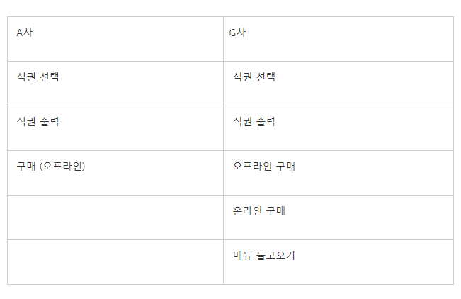

# 8장 경계 (Boundaries)

> 시스템에 들어가는 모든 소프트웨어를 직접 개발하는 경우는 드물다. 때로는 패키지를 사고, 때로는 오픈 소스를 이용한다. 때로는 사내 다른 팀이 제공하는 컴포넌트를 사용한다. 어떤 식으로든 이 외부 코드를 우리 코드에 깔끔하게 통합해야만 한다. (p.144)

이 장에서는 소프트웨어 경계를 깔끔하게 처리하는 기법과 기교를 살펴본다.

## 외부 코드 사용하기
> 인터페이스 제공자와 인터페이스 사용자 사이에는 입장차가 있다.

- 제공자 : 적용성을 최대한 넓히려 함 (더 많은 환경에서 돌아가야 더 많은 고객이 구매하니까)
- 사용자 : 자신의 요구에 집중하는 인터페이스를 바람

결국 이러한 입장차로 시스템 경계에서 문제가 생길 소지가 많다. 예를 들어 java.util.Map을 보자.

```
// Map이 제공하는 메서드
- clear() void - map
- containsKey(Object key) boolean - Map
- containsValue(Object value) boolean - Map
- entrySet() set - Map
- equals(Object o) boolean - Map
- get(Object key)Object - Map
- getClass() Class<? extends Object> - Object
- hashCode() int - Map
- isEmpty() boolean - Map
- keySet() Set - Map
- notify() void - Object
- notifyAll() void - Object
- put(Object key, Object value) Object - Map
- putAll(Map t) void - Map
- remove(Object key) Object - Map
- size() int - Map
- toString() String - Object
- values() Collection - Map
- wait() void - Object
- wait(long timeout) void - Object
- wait(long timeout, int nanos) void - Object
```

Map은 굉장히 다양한 인터페이스로 수많은 기능을 제공한다. 이는 굉장히 유용하지만 동시에 위험도 크다. 예를 들어
1. Map을 만들어 인수나 반환으로 이리저리 넘길 경우 clear() 메서드를 통해 어디선가 예상치 않게 지울 수 있다. Map사용자라면 누구나 clear()을 사용할 권한이 있기 때문이다. </br> 이렇듯 필요하지 않은 인터페이스를 의도치 않게 사용하게 될 수 있다.
2. Map에 특정 객체 유형만 저장하기로 결정했다고 가정하자. 그렇지만 Map은 객체 유형을 제한하지 않는다. 마음만 먹으면 사용자는 어떤 객체 유형도 추가할 수 있다.

물론 위의 2번의 경우 제네릭스(Generics)를 사용하면 해결할 수 있는 문제이다.

```java
// 제네릭스를 통해 Sensor라는 객체만을 담는 Map을 만든다.
Map<String, Seneor> Sensors = new HashMap<Sensor>();
...
// Sensor 객체를 가져온다.
Sensor s = sensors.get(sensorId);
```

하지만 2번의 방법도 문제는 있다. Map<String, Sensor> 인스턴스를 여기저기로 넘긴다면, Map 인터페이스가 변할 경우, 수정할 코드가 상당히 많아진다.

인터페이스가 변할 가능성이 거의 없다고 여길지도 모르지만, 자바 5가 제네릭스를 지원하면서 Map 인터페이스가 변했다는 사실을 명심해야 한다. 

그렇다면 어떻게 코드를 짜야 이런 외부 코드의 경계 인터페이스에서 자유로워질 수 있을까?

```java
public class Sensors {
    private Map sensors = new hashMap();

    public Sensor getById(String id) {
        return (Sensor) sensors.get(id);
    }

    // 이하 생략
}
```

경계 인터페이스인 Map을 Sensors 안으로 숨긴다. 이렇게 되면
1. Map 인터페이스가 변하더라도 나머지 프로그램에는 영향을 미치지 않는다.
2. Sensors 객체를 사용하는 사용자는 외부 라이브러리를 어떤 식으로 사용하는지 신경 쓰지 않아도 된다.
3. 필요하지 않은 인터페이스(위의 예제에서는 clear()와 같은)를 제공하지 않을 수 있다.
이 모든 것은 Sensors 클래스 안에서 객체 유형을 관리하고 변환하기 때문이다.

그렇다고 Map 클래스를 사용할 때마다 위와 같이 캡슐화하라는 소리가 아니다. Map을(혹은 이러한 경계 인터페이스를) 여기저기 넘기지 말라는 뜻이다.

즉, 이러한 경계 인터페이스가 이용하는 클래스의 밖으로 노출되지 않도록 주의하라는 뜻이다. 하지만 피치 못하게 노출될 경우에 위와 같이 캡슐화를 통해 설계 규칙을 지키도록 강제하는 것이 좋다.

</br>

## 경계 살피고 익히기
> 외부 패키지 테스트가 우리 책임은 아니다. 하지만 우리 자신을 위해 우리가 사용할 코드를 테스트하는 편이 바람직하다. (p.146)

타사 라이브러리를 처음 가져왔을 때 사용법이 분명치 않다면 우리는 대개
1. 하루나 이틀(혹은 더 많은 시간을) 문서를 읽으며 사용법을 결정
2. 코드를 작성해 라이브러리가 예상대로 동작하는지 확인하고, 디버깅의 반복

**학습 테스트**는 위와 다르게 외부 코드를 익히고 통합하는 과정을 쉽게 할 수 있다.

- 곧바로 우리 쪽 코드를 작성해 외부 코드를 호출하는 기존의 방법 대신 먼저 간단한 테스트 케이스를 작성해 외부 코드를 익힌다.
- 프로그램에서 사용하려는 방식대로 외부 API를 호출한다. 통제된 환경에서 API를 제대로 이해하는지를 확인하는 셈이다.

즉, 학습 테스트는 기능 구현을 위한 테스트라기보다 API, 라이브러리, 프레임워크가 **어떻게 동작하는지를 이해하고, 검증하기 위한 테스트**이다.

### log4j 익히기

**학습 테스트**가 어떻게 진행되는지 보기 위해 로깅 기능을 직접 구현하는 대신 아파치의 log4j 패키지를 사용하려 한다고 가정하자.
1. 패키지를 내려받아 소개 페이지를 연다.
2. 문서를 자세히 읽기 전에 첫 번째 테스트 케이스를 작성한다.

```java
// 화면에 "hello"를 출력하는 테스트 케이스이다.
@Test
public void testLogCreate() {
    Logger logger  = Logger.getLogger("MyLogger");
    logger.info("hello");
}
```

3. 테스트 케이스를 돌려본다.
    - Appender라는 뭔가가 필요하다는 오류가 발생한다.
4. 문서를 읽어보니 ConsoleAppender라는 클래스가 있다. 그래서 ConsoleAppender를 생성한 후 테스트 케이스를 다시 돌린다.

```java
@Test
public void testLogAddAppender() {
    Logger logger = Logger.getLogger("MyLogger");
    ConsoleAppender appender = new CondoleAppender();
    logger.addAppender(appender);
    logger.info("hello");
}
```

5. 이번에는 Appender에 출력 스트림이 없다는 사실을 발견한다. 구글을 검색한 후 아래와 같이 다시 시도해본다.

```java
@Test
public void testLogAppender() {
    Logger logger = Logger.getLogger("MyLogger");
    logger.removeAllAppenders();
    logger.addAppender(new ConsoleAppender(
        new PatternLayout("%p %t %m%n"),
        ConsoleAppender.SYSTEM_OUT));
    logger.info("hello");
}
```

이제야 "hello"가 들어간 로그 메시지가 콘솔에 찍힌다.

이런 식으로 **학습 테스트**를 통해 log4j의 기능을 익히고, 익힌 지식을 독자적인 로거 클래스로 캡슐화한다. </br>
그러면 나머지 프로그램은 log4j의 경계 인터페이스를 몰라도 된다.

### 학습 테스트는 공짜 이상이다

1. 학습 테스트에 드는 비용은 없다. 오히려 필요한 지식만 확보하는 손쉬운 방법이다. 따라서 학습 테스트는 공짜 이상이다. 투자하는 노력보다 얻는 성과가 더 크다.
2. 학습 테스트는 패키지가 예상대로 도는지 검증하고, 통합 이후에도 주기적으로 검증이 가능하다.
    - 패키지의 새 버전이 나오면 학습 테스트만 돌려 차이가 있는지 확인만 한다면 동작을 보장할 수 있다.
    - 이러한 경계 테스트가 있다면 패키지를 새 버전으로 이전하기 쉬워지면서 낡은 버전을 필요 이상으로 사용하지 않아도 된다.

</br>

## 아직 존재하지 않는 코드를 사용하기
> 경계와 관련해 또 다른 유형은 아는 코드와 모르는 코드를 분리하는 경계다. (p.150)

저자는 경계에 관해 이야기를 하며 무선통신 시스템에 들어갈 소프트웨어 개발에 참여했던 일화를 이야기해 주었다. 이 소프트웨어에는 '송신기'라는 하위 시스템이 있었는데, 저자의 팀은 이것에 관한 지식이 거의 없었다고 한다. 

그렇다면 두 손 두 발 다 놓고 있어야 할까? 그렇지 않다. 어쨌든, 우리가 '송신기'에 관한 지식은 없어도, '송신기' 모듈에게 원하는 기능은 알고 있기 때문에 여기서 바로 '경계'가 생기는 것이다.

> 지정한 주파수를 이용해 이 스트림에서 들어오는 자료를 아날로그 신호로 전송하라.

어차피 우리가 구현해야 할 부분은 '아는 코드'이다. 그렇다면 우리는 이것을 자체적인 인터페이스를 정의하여 구현하는 것이다.

* 필요한 인터페이스를 정의/구현하면 전적으로 통제가 가능해짐
* 테스트도 간편하게 진행할 수 있음

즉, 아직 존재하지 않는 코드 부분(모르는 코드, ex. 송신기 API)을 신경 쓰지 않고 일단 구현한다. 나중에 저쪽 팀이 송신기 API를 구현하면 우리는 **Adapter 패턴**으로 인터페이스 간의 호환성 문제를 해결하면 된다.

### Adapter 패턴
> Adapter 패턴은 B를 A처럼 포장하여 A로 사용할 수 있게 하는 패턴이다.

예를 들어 A사는 몇 년 전부터 식권 발매 시스템을 개발하여 운영하고 있다. 이 시스템이 안정적으로 운영되면서 최근 같은 사업을 하던 G그룹이 인수를 제안해왔고, 시스템을 통합하기로 했다. 두 회사의 시스템은 다음과 같다.

</img><br/>

```java
// A사 식권 발매 시스템

 public interface TicketA {
 
    public void choice(int token);
    public void print();
    public void buy();
}

public class TicketSystemA implements TicketA {
 
    @Override
    public void choice(int token) {
        System.out.println("선택된 식권 타입은... " + token + " 입니다");
    }
 
    @Override
    public void print() {
        System.out.println("식권을 출력합니다..");        
    }
 
    @Override
    public void buy() {
        System.out.println("식권을 구매합니다..");
    }
}
```
```java
// G사 식권 발매 시스템

public interface TicketG {
 
    public void choice(int token);
    public void print();
    public void buyOnOffline();
    public void buyOnOnline();
    public String getMenu();
}

public class TicketSystemG implements TicketG{
 
    @Override
    public void choice(int token) {
        System.out.println("선택된 식권 타입은... " + token + " 입니다");
    }
 
    @Override
    public void print() {
        System.out.println("식권을 출력합니다..");        
    }
 
    @Override
    public void buyOnOffline() {
        System.out.println("오프라인으로 구매합니다..");       
    }
 
    @Override
    public void buyOnOnline() {
        System.out.println("온라인으로 구매합니다..");        
    }
 
    @Override
    public String getMenu() {
        return "메뉴정보를 DB에서 가져왔습니다.";
    }
}
```

이제 기존 G사의 시스템 안에서 인수한 A사의 시스템이 정상적으로 돌아가야 하기 대문에, A사의 인터페이스를 G사에 맞게 다시 정의해 주어야 한다. 
하지만 다시 정의해 준다면 이미 같은 기능(식권 선택, 식권 출력, 오프라인 구매)이 있기 때문에 중복이 발생한다. 이 경우는 겨우 3개의 중복이지만 어떤 거대한 시스템이었다면? 엄청난 비효율을 불러올 것이다.

이때 필요한 것이 **Adapter 패턴**이다. 

```java
public class TicketAdapter implements TicketG{
 
    private TicketA ticket;
    
    public TicketAdapter(TicketA ticket) {
        super();
        this.ticket = ticket;
    }
 
    @Override
    public void choice(int token) {
        ticket.choice(token);
    }
 
    @Override
    public void print() {
        ticket.print();
    }
 
    @Override
    public void buyOnOffline() {
        ticket.buy();
    }
 
    @Override
    public void buyOnOnline() {
        throw new UnsupportedOperationException("지원되지 않는 기능");
    }
 
    @Override
    public String getMenu() {
        throw new UnsupportedOperationException("지원되지 않는 기능");
    }
}
```

위의 어뎁터를 보면, 생성자로 A사의 TicketSystemA을 그대로 받아오고, G사의 인터페이스를 구현하여 그대로 사용할 부분은 A사의 메서드를 호출하고, 새로운 기능의 경우 예외 처리를 한다. 

이제 G사의 인터페이스로 A사의 시스템 클래스를 성공적으로 사용할 수 있게 되었다. </br>
만약 어뎁터 패턴이 없었다면 G사와 A사의 개발자들은 기존의 코드를 모두 옮기는 노가다를 해야 했을 것이다.

</br>

## 깨끗한 경계
> 변경이 이루어질 때 경계를 통해 통제하고 있었다면 향후 변경으로 인해 발생하는 비용이 줄어들 수 있다.

- 경계에 위치하는 코드는 깔끔히 분리
    * 기대치를 정의하는 테스트 케이스 작성
    * 이쪽 코드에서 외부 패키지를 세세하게 알아야 할 필요가 없다.
    * 통제 불가능한 외부 패키지에 의존하는 대신 통제 가능한 우리 코드에 의존하는 편이 훨씬 좋다.
- 외부 패키지를 호출하는 코드를 가능한 줄여 경계를 관리
    * 새로운 클래스로 경계를 감싸거나 **Adapter 패턴**을 사용해 우리가 원하는 인터페이스를 패키지가 제공하는 인터페이스로 변환

결론은 앞서 저자가 설명한 것들을 잘 이용하여 외부 코드를 사용할 때 유지보수에 좋은 코드를 짜라는 것이다.