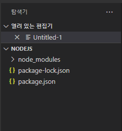
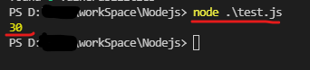

# npm(Node Package Manager) 소개와 설치

## npm이란?

Node Package Manager의 약자이다. 이름처럼 npm은 Node.js의 패키지를 설치하고 관리해주는 도구이다.

```
ex) Python의 pip, Ruby의 gem 등...
```

일반적인 경우 npm은 Node.js를 설치하면 자동으로 설치된다.

## 설치

> [Node.js 설치 페이지](https://nodejs.org/en/)

설치 페이지를 보면 LTS와 Stable 버전이 있는데 차이는 다음과 같다.

- LTS(Long Term Supported) 버전 : 짝수 버전이 LTS 버전으로 안정성과 보안성에 초점을 두어 개발한다.
- Stable 버전 : 홀수 버전이 Stable 버전으로 잦은 업데이트를 진행한다.

프론트 개발은 Stable 버전을 서버로 사용하려면 LTS를 추천한다.

## VSCode package.json Setting

먼저 VSCode에서 Workspace로 활용할 프로젝트 디렉토리를 생성한다. 나는 Nodejs로 만들어줬다.

이제 VSCode에서 생성한 Node.js 프로젝트 디렉토리를 열어준다.

터미널창에서 `npm init` 명령어를 실행한다.

```
PS D:\...\workSpace\Nodejs> npm init
This utility will walk you through creating a package.json file.
It only covers the most common items, and tries to guess sensible defaults.

See `npm help init` for definitive documentation on these fields
and exactly what they do.

Use `npm install <pkg>` afterwards to install a package and
save it as a dependency in the package.json file.

Press ^C at any time to quit.
package name: (nodejs)
version: (1.0.0)
description:
entry point: (index.js)
test command:
git repository:
keywords:
author:
license: (ISC)
About to write to D:\reed\workSpace\Nodejs\package.json:

{
  "name": "nodejs",
  "version": "1.0.0",
  "description": "",
  "main": "index.js",
  "scripts": {
    "test": "echo \"Error: no test specified\" && exit 1"
  },
  "author": "",
  "license": "ISC"
}


Is this OK? (yes)
npm notice
npm notice New minor version of npm available! 8.4.1 -> 8.5.1
npm notice Changelog: https://github.com/npm/cli/releases/tag/v8.5.1
npm notice Run npm install -g npm@8.5.1 to update!
npm notice

PS D:\...\workSpace\Nodejs>
```

`npm init`는 node.js를 실행하기 위한 initial 과정으로 이 과정을 통해 package.json 파일을 프로젝트 디렉토리에 생성해준다.

package.json은 npm을 통해 생성되는 node관련 component들의 dependency를 관리하는 모듈로서, Maven의 pom.xml과 비슷한 역할이라 생각하면 이해가 쉬울 수 있다.

이제 npm 모듈로 기본이 되는 express 모듈을 설치해 보도록 하자. </br>
터미널에 npm install [module] [option]을 입력하면 된다. `npm install express --save`

```
PS D:\...\workSpace\Nodejs> npm install express --save

added 50 packages, and audited 51 packages in 2s

2 packages are looking for funding
  run `npm fund` for details

found 0 vulnerabilities
```

npm install를 통해 package-lock.json과 node_modules라는 디렉토리가 생성되었다.

package.json 파일을 보면 하단에 dependencies가 생성된 것을 볼 수 있는데, 이는 Node.js을 Runtime으로 실행할 경우 실제 Application Package와 함께 packaging 되는 Library 파일로 자동으로 버전 관리가 이루어질 수 있도록 한다.

또한 devDependencies로 추가되는 경우 배포하기 위한 패키징에 포함시키지 않도록 구분하여 관리할 수 있다. 쉽게 생각하자면 Testing 관련 라이브러리, 로그 관련 라이브러리 등 개발 환경에서 분석을 위해 추가한 라이브러리를 운영환경에 적용하지 않도록 관리할 수 있는 라이브러리 디펜던시라 할 수 있다.

</img><br/>

설치를 무사히 마쳤다면 위와 같이 탐색기에서

1. npm init으로 생성한 package.json
2. npm install로 생성한 express node module
   을 확인할 수 있다.

## VSCode에서 node.js 실행해보기

test.js 파일을 만들어 다음과 같은 코드를 작성하고, 터미널 창에서 무사히 실행되는지 확인해본다.

```node.js
var num1 = 10;
var num2 = 20;
var num3 = num1 + num2;

console.log(num3);
```

</img><br/>
