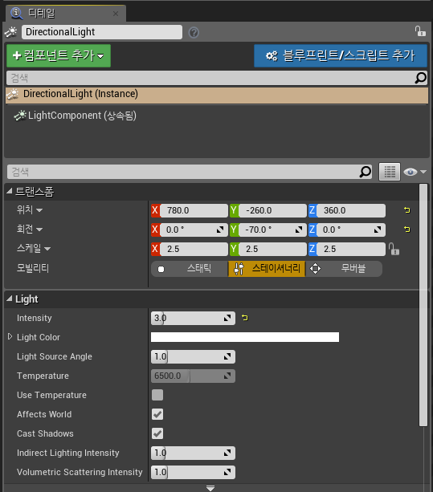
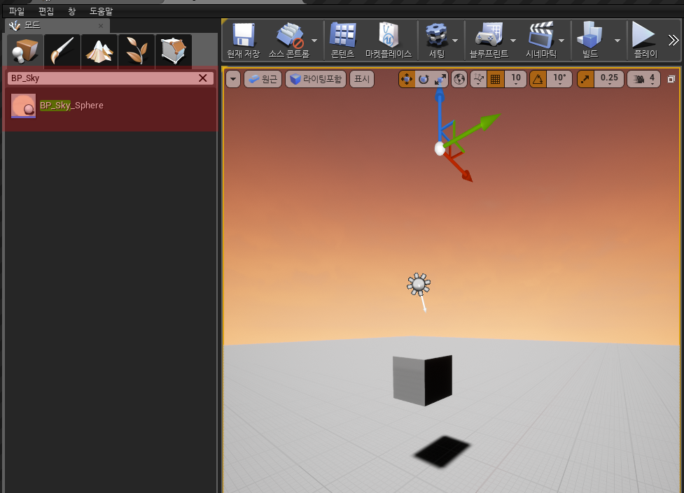

# Unreal Intro

## 목차

- [언리얼 엔진](#언리얼-엔진)
- [프로젝트 생성](#프로젝트-생성)
  - UI 구성
- [맵 생성](#맵-생성)
  - 액터란?
  - 레벨이란?
- [라이트 세팅](#라이트-세팅)
  - 라이트 모빌리티
- [하늘 생성](#하늘-생성)
- [Ambient Light](#Ambient-Light)
- [Post Process Volume](#Post-Process-Volume)

</br>

## 언리얼 엔진

> [Unreal 다운로드](https://www.unrealengine.com/ko/feed?sessionInvalidated=true)

- 게임 엔진이란 게임 개발에 필요한 여러 필수 요소들(물리 엔진, 그래픽 엔진, UI 시스템, 프레임 워크 등)을 제공해주는 게임 개발 소프트웨어를 말한다. 대표적으로 언리얼과 유니티 등이 있다.
- 게임 회사들은 언리얼이나 유니티 등의 상용화 된 게임 엔진을 사용하거나 자체적으로 개발한 게임 엔진을 사용한다.
- 언리얼 엔진이란 에픽게임즈에서 개발한 3D 게임 엔진으로 강력한 그래픽 성능과 편리한 인터페이스가 강점이다.

</br>

## 프로젝트 생성

</img><br/>

이 프로젝트는 언리얼 엔진 4.18.3 ver로 진행된다. 설치를 마치면 라이브러리에 설치가 완료된 엔진이 노출된다. 실행을 누른다.

</img><br/>

프로젝트는 1인칭의 배틀로얄-FPS 게임을 개발할 것이므로 '일인칭' 템플릿을 선택하여 프로젝트를 생성한다.

</img><br/>

언리얼 엔진의 UI 구성을 한 눈에 볼 수 있도록 정리해 보았다.

</br>

## 맵 생성

게임에 있어 가장 먼저 필요로 하는 것은 플레이어들이 싸우는 공간 즉, '맵'이다. 이제부터 맵을 생성해 볼 것이다.

</img><br/>

콘텐츠 브라우저에서 우클릭을 통해 '레벨'을 생성한다. 이 프로젝트에서는 정글이 우거진 섬을 전장으로 하는 맵을 만들 예정이기 때문에 이름을 'Jungle'로 지어줬다.

```
# 액터란?
    - 언리얼 엔진에서 액터는 월드에 존재하는 기본 물체 단위를 의미한다.
    - 액터들은 월드 아웃라이너 창에서 관리한다.
# 레벨이란?
    - 레벨은 액터의 모음이다.
    - 예를 들어 학교라는 맵이 있다면 거기엔 학교 외관을 담당하는 건물 액터부터 책상, 칠판, 가방 등의 수많은 액터들이 존재할 것이다. 이러한 모든 액터를 '학교'라는 이름으로 묶어주는 것이 레벨이다.
```

처음 레벨을 생성하면 라이팅조차 없는 비어있는 상태이므로 아무것도 보이는 것 없이 깜깜하다. 그렇다면 액터를 추가하면 뭐라도 보이게 될까? 모드 창에서 큐브 액터를 뷰포트로 끌어와 생성해 봐도 큐브는커녕 여전히 아무것도 보이지 않는다. 이유는 현재 뷰 모드가 라이팅포함 모드인데 라이팅(빛)이 없기 때문이다.

</img><br/>

따라서 이미지와 같이 뷰 모드를 **라이팅 제외**로 변경해주면 라이팅 없이도 액터의 모습을 볼 수 있다.

여기에 라이팅 작업을 위해 평면 액터를 생성하여 디테일 창에서 스케일을 100 x 100으로 세팅해준다.

</img><br/>

## 라이트 세팅

이제 라이팅(빛)을 생성해 줄 것이기 때문에 뷰포트의 뷰 모드를 다시 기존의 **라이팅 포함**으로 변경해준다.

보통 태양광과 같은 월드 내의 전체적인 빛은 **_Directional Light_**가 적합하다. (모드-라이트-디렉셔널 라이트) 라이트를 맵에 추가해주자 큐브에 그림자가 지며 물체가 보이기 시작한다.

</img><br/>

이제 디테일 창으로 가서 라이트를 내가 원하는 쪽으로 수정해주자.

</img><br/>

```
# 라이트 모빌리티
    - Static : 게임 플레이 전 라이트 정보를 미리 전부 연산하여 라이트 맵을 구워 놓는 완벽한 정적인 방식이다. 성능이 가장 좋은데, 이는 게임 실행 중에 라이트 연산을 하지 않기 때문에 게임 성능에 영향을 주지 않기 때문이다.
    - Movable : 게임 실행 중에 라이트의 모든 속성을 연산하기 때문에 라이트 맵을 전혀 구워놓지 않는 완벽한 동적인 방식이다. 상대적으로 성능이 떨어지며 게임 플레이 중에도 라이트의 속성이 변경될 수 있다.
    - Stationary : 위의 두 모드(Static + Movable)를 적절히 섞어 몇몇 라이트 속성에 대해서만 미리 연산하여 라이트 맵을 구워 놓고, 나머지는 런타임에 결정한다.
```

## 하늘 생성

언리얼에서는 **_BP_Sky_Sphere_**라는 하늘 블루프린트를 지원한다. (모드-검색-BP_Sky_Sphere)

</img><br/>

하늘을 적용해주니 기본적으로 석양 모드로 되어있다. 아까 나는 라이트 세팅에서 태양광(Directional Light)을 세팅해줄 때 대낮으로 세팅했었는데 둘이 따로 놀고 있는 셈이다. 이는 BP_Sky_Sphere의 디테일 창에서 **Directional Light Actor** 변수에 아까 만들어준 태양광(**Directional Light**)를 할당해주면 된다.

</img><br/>

이걸로 하늘 상태의 기준이 될 빛을 지정해 준 것이다.

## Ambient Light

</img><br/>

하늘까지 만들어 줬지만 오브젝트를 보면 아직도 그림자가 부자연스럽다. 그림을 그려본 사람이라면 알 텐데, 그림자는 칠흑 같은 검은색이 아니다. 환경에 따라 그림자의 색은 영향을 받으며, 간접광과 반사광 등의 각종 고려해야 할 빛들이 많다. 이런 자연스러움을 주기 위해 **_스카이 라이트_**를 추가해 줄 것이다. (모드-라이트-스카이 라이트)

</img><br/>

**_스카이 라이트_**를 적용하자 확연히 자연스러워진 그림자를 볼 수 있다.

이때 주의해야 할 점은 태양광인 Directional Light의 각도가 변경되면 하늘의 상태와 스카이 라이트의 상태는 수동으로 업데이트해 줘야 한다.

</img><br/>

**하늘**의 경우 BP_Sky_Sphere의 디테일 창의 **Refresh Material**을 클릭해주면 된다.

</img><br/>

**스카이 라이트**의 경우 디테일 창의 **씬 리캡처**를 클릭해주면 된다.

## Post Process Volume

</img><br/>

라이트 세팅의 마지막으로 영상의 후처리를 맡아줄 Post Process Volume을 세팅해 줄 것이다. 일종의 카메라 필터를 생각하면 될 것이다. 이것을 세팅해주는 이유는 간단하다. 위의 사진을 보면 내가 만든 맵에서 하늘을 바라보면 계속 하얗게 타버리는 현상이 발생하기 때문이다. Post Process Volume을 이용하여 밝기의 min 값과 max 값을 지정해줘서 해결해 보겠다. (모드-볼륨-Post Process Volume)

```
# Post Process Volume
    - 전체 화면 필터 및 효과를 화면에 표시하기 전에 카메라의 이미지 버퍼에 적용하는 프로세스이다.
    - 기존에 렌더링 된 씬에 렌더링 효과를 더하는 작업이다.
```

</img><br/>

처음 Post Process Volume을 적용하면 카메라가 저 볼륨안에 들어가 있을 때만 영상 후처리가 적용된다.

</img><br/>

따라서 이를 맵 전체에 적용하고 싶다면 디테일 창의 **Infinite Extent**값에 체크해준다. 이제 월드 전체를 커버해 줄 것이다.

</img><br/>

이제 원래 목적이었던 빛의 min 값과 max 값을 조정해주면 더는 하늘을 바라봐도 하얗게 타는 현상이 생기지 않는다. 이걸로 기본적인 맵과 라이트 세팅이 모두 끝났다.
