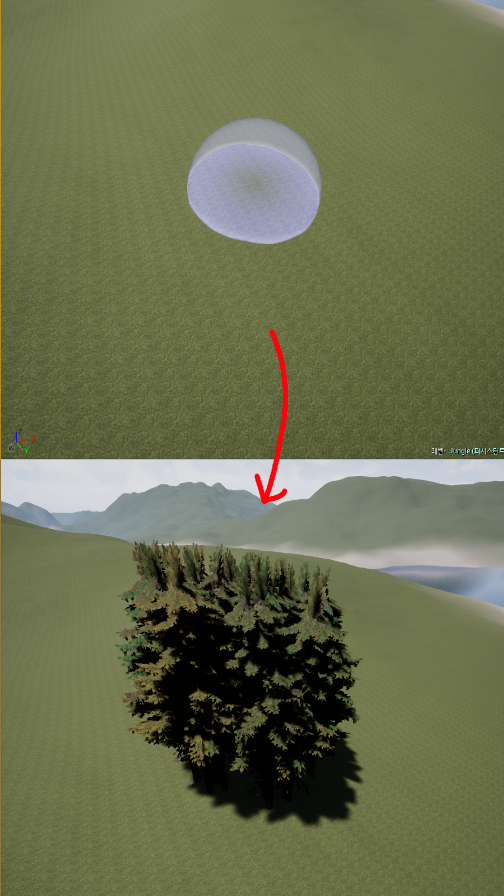

# 폴리지

## 목차

- [폴리지 모드](#폴리지-모드)
  - 나무 심기
  - 에셋이란?
  - Cull Distance
  - 콜리전 프리셋
- [프로시저럴 폴리지 볼륨](#프로시저럴-폴리지-볼륨)

</br>

## 폴리지 모드

텅 빈 맵에 나무를 심어 정글의 기본을 만들고자 한다. 그렇다면 우리는 이 넓은 맵에 손수 나무를 한 그루 한 그루 심어야 할까? 이럴 때 필요한 기능이 바로 언리얼에서 제공하는 **폴리지 모드**이다.

</img><br/>

```
# 폴리지 툴(Foliage Tool)
    - 필터가 활성화된 액터 및 지오메트리에 스태틱 메시 또는 액터 폴리지 세트를 빠르게 칠하고 지울 수 있다.
```

이때, 폴리지 모드를 이용하기 전에 먼저 필요한 것은 바로 나무 에셋이다. 콘텐츠브라우저에서 준비한 나무(와 잔디 등)에셋을 임포트 해준다. 나는 언리얼에서 제공하는 [UE 마켓플레이스](https://www.unrealengine.com/id/login/api/login?client_id=43e2dea89b054198a703f6199bee6d5b&redirect_uri=https%3A%2F%2Fwww.unrealengine.com%2Fmarketplace%2Fko%2Fstore%3FsessionInvalidated%3Dtrue&prompt=pass_through)에서 무료 에셋을 다운받았다.

> 문서 [BattleRoyal/README.md](https://github.com/algoribi/BattleRoyal/blob/main/README.md)에 프로젝트에 사용된 모든 텍스처와 에셋의 출처가 표기되어 있으니 참고 바람.

```
# 에셋(asset)이란?
    - 에셋은 게임을 만드는 데 사용되는 요소를 말한다.
    - 콘텐츠 브라우저에서 임포트하거나 만들 수 있는 콘텐츠로 머터리얼, 스태틱 메시, 텍스처, 파티클 시스템, 블루프린트, 사운드 큐 등이 있다.
```

내가 임포트해온 나무 에셋의 스태틱 메시를 더블 클릭하면 아래와 같이 미리 나무 모델을 봐 볼 수도 있고, 여러 설정을 조정할 수도 있다.

</img><br/>

여기서 우린 LOD(레벨 오브 디테일)값을 가장 낮은 값인 4로 줄 것이다.

</img><br/>

다음으로 나무 에셋의 폴리지 타입의 속성을 게임에 맞게 손봐준다. 이중 꼭 봐줘야 하는 설정은 컬링 거리를 설정하는 Cull Distance와 콜리전 프리셋이다.

```
# Cull Distance
    - Cull Distance는 플레이어의 시야에서 어느 정도 거리부터 이 물체를 보일 건지 설정하는 것이다. 이것을 설정해놓지 않으면 부하가 심해지기 때문에 꼭 설정해둬야 한다. 지금은 개발 중이니 실제 적용될 값보다 더 짧게 설정해두었다.
# 콜리전 프리셋
    - 콜리전 프리셋은 물체의 충돌에 관한 설정이다. 현재 설정하고 있는 나무는 fps 게임에서 플레이어가 엄폐물로 쓰이는 물체이기 때문에 충돌 설정이 꼭 필요하다. 따라서 BlockAllDynamic 값을 준다.
```

</img><br/>

이제 우리가 만든 폴리지 타입의 나무를 추가해준다.

</img><br/>

이제 뷰포트에서 브러시를 움직여주면 우리가 지정해준 나무들이 생긴다.

</img><br/>

하지만 보다시피 나무가 엄청 빽빽하게 생성되었다. 이건 자연스러운 숲이라기엔 무리가 있다. 따라서 나무가 생성되는 간격을 조절해준다.

</img><br/>

설정을 통해 나무가 적당한 간격으로 심어지지만, 또 다른 문제가 있다.

</img><br/>

나무는 잔디가 있는 땅 위에서만 심어져야 자연스러운데, 모래사장이나 바다에도 심어진다. 이를 해결하기 위해 나무의 폴리지 타입 설정으로 들어가 Placement 옵션의 **Landscape Layers에 Grass를 추가**한다. Landscape Layers 기능은 특정 레이어에만 이 폴리지를 생성할 수 있도록 설정하는 것이다.

</img><br/>

이렇게 해서 나무가 Grass layer 영역에만 생성될 수 있도록 설정해 주었다.

</img><br/>

## 프로시저럴 폴리지 볼륨

폴리지 모드를 통해 맵에 나무를 심는(칠하는) 법을 배웠다. 하지만 이것을 수작업으로 다 칠해주기엔 이 프로젝트의 맵이 너무나도 크다. 이럴 때 필요한 기능이 바로 **프로시저럴 폴리지 볼륨**이다. 이 기능을 켜기 위해 에디터 개인설정에서 **Procedural Foliage**항목에 체크를 해준다. (편집-에디터 개인설정-실험단계 기능-Procedural Foliage)

</img><br/>

이 기능을 켜고 나면 폴리지 타입의 디테일에 프로시저럴(Procedural) 기능이 생겨있다. 또한, 모드에서 foliage를 검색해보면 프로시저럴 폴리지 볼륨이라는 목록이 생겨있음을 확인할 수 있다.

</img><br/>

이제부터 이 기능을 사용하여 나무를 심어보자. 프로시저럴 폴리지 볼륨을 맵으로 끌어와 생성한다.

</img><br/>

스케일을 100 x 100 x 100으로 키워보자 박스 모양으로 영역을 보인다. 이걸 보면 느낌이 오겠지만 저 영역만큼 폴리지를 자동으로 생성해주는 기능이다.
디테일 창을 내려보면 폴리지 스포너(Foliage Spawner)라는 변수를 볼 수 있다. 이곳에 우리가 자동으로 생성해줄 폴리지 타입을 지정해 주는 것 같다. 하지만 기존의 폴리지 타입을 바로 넣을 수는 없고, 그에 맞는 폴리지 스포너(Foliage Spawner)타입을 만들어 줘야 한다.

</img><br/>

폴리지 스포너의 설정은 배열을 하나 추가한 뒤 우리가 원하는 폴리지 타입을 추가해주면 된다.

</img><br/>

설정을 마쳤다면 프로시저럴 폴리지 볼륨에 폴리지 스포너를 추가해 주고, 다시 시뮬레이션을 누른다.

</img><br/>

</img><br/>

</img><br/>

이때, 심어진 나무의 간격이 맘에 들지 않는다면 기존 폴리지 타입(심기로 했던 나무의 폴리지 타입)에 가서 Procedural의 콜리전 값들을 적당히 바꿔가며 원하는 모양새가 나올 때까지 조정해주면 된다.

</img><br/>

</img><br/>

얼추 맘에 들게 설정을 완료했다면 이 프로시저럴 폴리지 볼륨 박스의 영역을 맵 전체로 확장해 맵에 자동으로 나무를 심을 수 있을 것이다.

</img><br/>

이 상태로 프로시저럴 폴리지 볼륨의 **다시 시뮬레이션**을 누르면

</img><br/>

이렇게 맵 전체에 성공적으로 나무가 심어진 것을 확인할 수 있다.

</img><br/>
