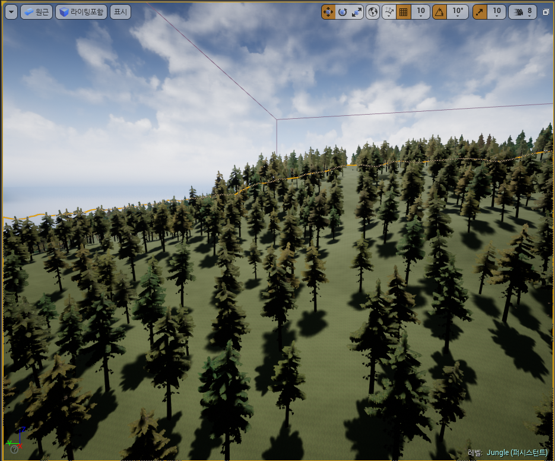
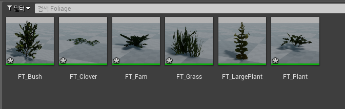

# 폴리지

## 목차

- [폴리지 모드](#폴리지-모드)
  - 나무 심기
  - 에셋이란?
  - Cull Distance
  - 콜리전 프리셋
- [프로시저럴 폴리지 볼륨](#프로시저럴-폴리지-볼륨)
- [프로시저럴 폴리지 블로킹 볼륨](#프로시저럴-폴리지-블로킹-볼륨)
- [레벨 스트리밍](#레벨-스트리밍)
  - 스트리밍 레벨 바운드
  - 월드 컴포지션 레이어 생성 시 주의사항

</br>

## 폴리지 모드

텅 빈 맵에 나무를 심어 정글의 기본을 만들고자 한다. 그렇다면 우리는 이 넓은 맵에 손수 나무를 한 그루 한 그루 심어야 할까? 이럴 때 필요한 기능이 바로 언리얼에서 제공하는 **폴리지 모드**이다.

</img><br/>

```
# 폴리지 툴(Foliage Tool)
    - 필터가 활성화된 액터 및 지오메트리에 스태틱 메시 또는 액터 폴리지 세트를 빠르게 칠하고 지울 수 있다.
```

이때, 폴리지 모드를 이용하기 전에 먼저 필요한 것은 바로 나무 에셋이다. 콘텐츠브라우저에서 준비한 나무(와 잔디 등)에셋을 임포트 해준다. 나는 언리얼에서 제공하는 [UE 마켓플레이스](https://www.unrealengine.com/id/login/api/login?client_id=43e2dea89b054198a703f6199bee6d5b&redirect_uri=https%3A%2F%2Fwww.unrealengine.com%2Fmarketplace%2Fko%2Fstore%3FsessionInvalidated%3Dtrue&prompt=pass_through)에서 무료 에셋을 다운받았다.

> 문서 [BattleRoyal/README.md](https://github.com/algoribi/BattleRoyal/blob/main/README.md)에 프로젝트에 사용된 모든 텍스처와 에셋의 출처가 표기되어 있으니 참고 바람.

```
# 에셋(asset)이란?
    - 에셋은 게임을 만드는 데 사용되는 요소를 말한다.
    - 콘텐츠 브라우저에서 임포트하거나 만들 수 있는 콘텐츠로 머터리얼, 스태틱 메시, 텍스처, 파티클 시스템, 블루프린트, 사운드 큐 등이 있다.
```

내가 임포트해온 나무 에셋의 스태틱 메시를 더블 클릭하면 아래와 같이 미리 나무 모델을 봐 볼 수도 있고, 여러 설정을 조정할 수도 있다.

</img><br/>

여기서 우린 LOD(레벨 오브 디테일)값을 가장 낮은 값인 4로 줄 것이다.

</img><br/>

다음으로 나무 에셋의 폴리지 타입의 속성을 게임에 맞게 손봐준다. 이중 꼭 봐줘야 하는 설정은 컬링 거리를 설정하는 Cull Distance와 콜리전 프리셋이다.

```
# Cull Distance
    - Cull Distance는 플레이어의 시야에서 어느 정도 거리부터 이 물체를 보일 건지 설정하는 것이다. 이것을 설정해놓지 않으면 부하가 심해지기 때문에 꼭 설정해둬야 한다. 지금은 개발 중이니 실제 적용될 값보다 더 짧게 설정해두었다.
# 콜리전 프리셋
    - 콜리전 프리셋은 물체의 충돌에 관한 설정이다. 현재 설정하고 있는 나무는 fps 게임에서 플레이어가 엄폐물로 쓰이는 물체이기 때문에 충돌 설정이 꼭 필요하다. 따라서 BlockAllDynamic 값을 준다.
```

</img><br/>

이제 우리가 만든 폴리지 타입의 나무를 추가해준다.

</img><br/>

이제 뷰포트에서 브러시를 움직여주면 우리가 지정해준 나무들이 생긴다.

</img><br/>

하지만 보다시피 나무가 엄청 빽빽하게 생성되었다. 이건 자연스러운 숲이라기엔 무리가 있다. 따라서 나무가 생성되는 간격을 조절해준다.

</img><br/>

설정을 통해 나무가 적당한 간격으로 심어지지만, 또 다른 문제가 있다.

</img><br/>

나무는 잔디가 있는 땅 위에서만 심어져야 자연스러운데, 모래사장이나 바다에도 심어진다. 이를 해결하기 위해 나무의 폴리지 타입 설정으로 들어가 Placement 옵션의 **Landscape Layers에 Grass를 추가**한다. Landscape Layers 기능은 특정 레이어에만 이 폴리지를 생성할 수 있도록 설정하는 것이다.

</img><br/>

이렇게 해서 나무가 Grass layer 영역에만 생성될 수 있도록 설정해 주었다.

</img><br/>

## 프로시저럴 폴리지 볼륨

폴리지 모드를 통해 맵에 나무를 심는(칠하는) 법을 배웠다. 하지만 이것을 수작업으로 다 칠해주기엔 이 프로젝트의 맵이 너무나도 크다. 이럴 때 필요한 기능이 바로 **프로시저럴 폴리지 볼륨**이다. 이 기능을 켜기 위해 에디터 개인설정에서 **Procedural Foliage**항목에 체크를 해준다. (편집-에디터 개인설정-실험단계 기능-Procedural Foliage)

</img><br/>

이 기능을 켜고 나면 폴리지 타입의 디테일에 프로시저럴(Procedural) 기능이 생겨있다. 또한, 모드에서 foliage를 검색해보면 프로시저럴 폴리지 볼륨이라는 목록이 생겨있음을 확인할 수 있다.

</img><br/>

이제부터 이 기능을 사용하여 나무를 심어보자. 프로시저럴 폴리지 볼륨을 맵으로 끌어와 생성한다.

</img><br/>

스케일을 100 x 100 x 100으로 키워보자 박스 모양으로 영역을 보인다. 이걸 보면 느낌이 오겠지만 저 영역만큼 폴리지를 자동으로 생성해주는 기능이다.
디테일 창을 내려보면 폴리지 스포너(Foliage Spawner)라는 변수를 볼 수 있다. 이곳에 우리가 자동으로 생성해줄 폴리지 타입을 지정해 주는 것 같다. 하지만 기존의 폴리지 타입을 바로 넣을 수는 없고, 그에 맞는 폴리지 스포너(Foliage Spawner)타입을 만들어 줘야 한다.

</img><br/>

폴리지 스포너의 설정은 배열을 하나 추가한 뒤 우리가 원하는 폴리지 타입을 추가해주면 된다.

</img><br/>

설정을 마쳤다면 프로시저럴 폴리지 볼륨에 폴리지 스포너를 추가해 주고, 다시 시뮬레이션을 누른다.

</img><br/>

</img><br/>

</img><br/>

이때, 심어진 나무의 간격이 맘에 들지 않는다면 기존 폴리지 타입(심기로 했던 나무의 폴리지 타입)에 가서 Procedural의 콜리전 값들을 적당히 바꾸고 프로시저럴 폴리지 볼륨의 **_다시 시뮬레이션_**을 통해 원하는 모양새가 나올 때까지 조정해주면 된다.

</img><br/>

</img><br/>

얼추 맘에 들게 설정을 완료했다면 이 프로시저럴 폴리지 볼륨 박스의 영역을 맵 전체로 확장해 맵에 자동으로 나무를 심을 수 있을 것이다.

</img><br/>

이 상태로 프로시저럴 폴리지 볼륨의 **다시 시뮬레이션**을 누르면

</img><br/>

이렇게 맵 전체에 성공적으로 나무가 심어진 것을 확인할 수 있다.

</img><br/>

## 프로시저럴 폴리지 블로킹 볼륨

사실 게임의 맵에는 나무 외에도 건물이나 도로 등의 다른 오브젝트들이 존재한다. 하지만 우리는 프로시저럴 폴리지 볼륨을 통해 맵 전체를 감싸서 나무를 심었는데, 어떻게 해야 이 나무를 필요한 만큼 치워서 다른 오브젝트를 만들 공간을 확보할 수 있을까? 간단하게 폴리지 모드에서 나무 오브젝트를 필요한 공간 만큼 직접 지워줄 수 있을 것이다. 하지만 우리가 개발을 진행하며 필요에 따라 프로시저럴 폴리지 볼륨을 **_다시 시뮬레이션_**하게 된다면? 이렇게 손수 지워줬던 영역에는 다시 나무가 생성될 것이다. 왜냐면 여전히 그 영역은 프로시저럴 폴리지 볼륨의 시뮬레이션 영역일 테니까 말이다.
이때 필요한 기능이 바로 **프로시저럴 폴리지 블로킹 볼륨**이다. (모드-Foliage 검색-Procedural Foliage Blocking Volume)

</img><br/>

프로시저럴 폴리지 블로킹 볼륨을 생성한 뒤 크기를 대략 40 x 40 x 40으로 키워 본다.

</img><br/>

블로킹 영역을 확보한 뒤 프로시저럴 폴리지 볼륨을 **_다시 시뮬레이션_** 해본다.

</img><br/>

보이는 것처럼 블로킹 영역만 나무가 심어지지 않는 것을 확인할 수 있다.

## 레벨 스트리밍

레벨 스트리밍에 들어가기에 앞서 맵의 환경에서 나무 외에 필요한 에셋들(잔디, 풀 등)에 대해 추가로 폴리지 작업을 진행해 주었다.

</img><br/>

```
# 받아온 에셋 파일과 텍스처들이 제각각이라 색감에 통일성을 주고 싶다면?
    - (주의) 이 방법은 색감을 통일하기 위해 머티리얼의 여러 기능을 만져보고, 또 취미로 디지털 드로잉과 사진 편집을 공부했을 때의 지식을 바탕으로 만들어 낸 긴급 처방 같은 방법이기 때문에 후에 어떤 문제를 야기할지 모른다.
    - 머티리얼의 베이스 컬러값에 기존의 변수와 Material Expression Constant 3Vector로 색감을 통일시켜줄 색상을 Multiply 해준다. 여기서 주의할 점은 포토샵이나 클립 스튜디오와 같은 툴을 통해 사진 편집이나 그림을 그려 본 사람이라면 알겠지만, Multiply(곱하기)는 색을 곱하여 합성하는 것으로 색이 필연적으로 진해진다. 따라서 Material Expression Constant 3Vector의 값을 내가 원하는 색보다 채도와 명도를 높게 잡아야 한다.
    - 아래 이미지 참고
```

</img><br/>

이제 준비한 풀과 잔디들을 맵에 심어보자. 이것도 나무와 같이 프로시저럴 폴리지 볼륨을 통해 심으면 간편하지 않을까? 하지만 그렇게 되면 맵 전체에 엄청난 수의 폴리지 개체가 존재하게 될 것이다. 따라서 성능상의 문제가 발생할 수 있다. 이럴 때 사용하기 좋은 기능이 바로 **_레벨 스트리밍_**이다.

```
# 레벨 스트리밍
    - 메모리 사용량을 줄이고 로딩화면 없는 월드를 만들기 위해 플레이 도중 레벨을 비동기 로드/언로드하는 기법이다.
    - 스트리밍 레벨은 퍼시스턴트 레벨(현재 맵)의 자식 레벨이며, 퍼시스턴트가 살아있는 한 언제든지 로드/언로드가 가능하다.
    - 나무의 경우 '정글 섬' 답게 멀리서도 그 실루엣이 보여야 하는 중요한 오브젝트이기 때문에 퍼시스턴트 레벨에 프로시저럴 폴리지 볼륨을 통해 생성했지만, 그 외의 경우는 상황에 따라 로드/언로드를 해주는 스트리밍 좋을 것이다.
# 기본 세팅
    - 월드 컴포지션 활성화 : 세팅 -> 월드 세팅 -> Enable Wold Composition 체크
    - 레벨 탭 오픈 : 창 -> 레벨
    - 폴리지 -> 페인트 -> 현재 레벨에 배치
```

레벨 탭에서 새로 생성을 통해 원하는 위치에 레벨을 생성한다. 레벨은 여러 개도 생성이 가능하다.

</img><br/>

</img><br/>

레벨이 생성된 것을 확인할 수 있다.
레벨에 액터를 추가하려면 레벨을 **_현재 레벨_**로 만들어야 한다. (우클릭-현재로 만들기) 현재 레벨은 뷰포트 오른쪽 하단을 통해 확인할 수 있다.

</img><br/>

이제 만들어준 스트리밍 레벨에 잡초들을 심어보고 로드와 언로드를 해보겠다.

</img><br/>

</img><br/>

마치 포토샵의 레이어 기능과 비슷한 느낌이다. 이렇게 항상 켜져 있을 필요가 없는 잔디와 같은 폴리지를 스트리밍용 레벨에 담아 관리할 것이다.

### 스트리밍 레벨 바운드

**레벨 스트리밍**이라는 개념을 통해 많은 수의 폴리지를 어떻게 관리하여 로드할 것인지 해결했다면 어느 시점부터 액터들을 스트리밍할 것인지를 정해줘야 한다. 이때 통상적으로 쓰기 좋은 개념은 **_거리_**이다. 즉, 일정 거리에 도달하면 액터를 로딩해주는 방식이다. (언리얼에서는 이 기본값이 500m이다.)
그럼 여기서 드는 또 하나의 의문점은 이 거리는 액터의 어디를 기준으로 거리를 측정하는 것인가? 이다. 이때 나오는 개념이 바로 **_바운드_**이다. 바운드를 보다 쉽게 이해하기 위해 레벨에 큐브 액터 두 개를 공간을 두고 생성해본다. (모드-배치-기본-큐브)

</img><br/>

큐브를 생성하고 나면 월드 아웃라이너에 **_LevelBounds_**가 생긴 것을 볼 수 있다. 이것을 클릭하면 뷰포트에서 바운드 영역을 확인할 수 있는데, 바로 이 영역을 기준으로 플레이어와의 거리를 측정하여 해당 바운드를 로드한다. 이 레벨바운드 영역은 언리얼에서 레벨 안에 있는 액터들의 좌푯값을 계산하여 자동으로 업데이트된다.

</img><br/>

하지만 여기에는 치명적인 단점이 있다. 바로 폴리지는 자동으로 레벨바운드 영역을 업데이트해 주는 것에 포함되지 않는다는 것이다. 만들어뒀던 큐브를 지우고 폴리지를 심어보면 레벨바운드가 활성화되지 않는 것을 확인할 수 있다.
따라서 우리는 수동으로 바운드를 세팅해줘야 한다. 그러니 자동으로 레벨바운드를 업데이트해 주는 옵션은 꺼주도록 하자. (디테일-Auto Update Bounds 체크 해제)

</img><br/>

다음으로 레벨바운드의 스케일값을 100000(1km) x 100000(1km) x 100000(1km)으로 잡아준 뒤 폴리지를 심을 위치에 배치해준다.

</img><br/>

이제 앞서 말했던 **_스트리밍 거리_**를 설정해 보자. 월드 컴포지션 창을 열어 레이어를 하나 생성한다. (레벨-월드 컴포지션)

</img><br/>

이름은 FoliageLevels로, 스트리밍 거리는 30000(300m)로 설정해 주고 생성을 눌러 새 레이어를 만들어 주었다.

</img><br/>

이제 월드 컴포지션 창을 쭉 둘러보자. 이리저리 훑어보면 활성화되어있는 박스를 찾을 수 있다. 한눈에 보아도 방금 우리가 만들어주었던 **_레벨바운드_**만큼의 영역을 표시해주고 있는 것처럼 보인다. 이처럼 월드 컴포지션 창은 우리가 만든 **_스트리밍 레벨_**들을 한눈에 확인할 수 있는 역할을 해준다. 근처의 커서 모양은 현재 카메라의 위치를 표시해준 것이다.

</img><br/>

스트리밍 레벨을 우클릭해서, 앞서 만들어두었던 FoliageLevels 레이어를 할당해 준다. 이렇게 되면 이 스트리밍 레벨에 포함된 모든 오브젝트의 스트리밍 거리는 자동으로 설정해 놨던 300m가 될 것이다.

</img><br/>

```
# 월드 컴포지션 레이어 생성 시 주의사항
    - 월드 컴포지션에서 레이어는 한 번 생성한 후에는 수정이 불가능하기 때문에 처음 만들 때 신경 써서 만들어주자.
    - 같은 이유로 값의 수정이 필요할 경우 새로운 레이어를 생성 후 스트리밍 레벨마다 레이어를 다시 할당해 줘야 한다.
    - 만약 레벨이 하나도 할당되어 있지 않은 레이어의 경우 후에 자동으로 삭제가 된다고 한다.
```

지금까지의 작업을 응용하여 맵 전체를 적절한 구획으로 나누고, 구획에 맞게 스트리밍 레벨을 만들면 폴리지 개체를 로딩하는데 생기는 부하를 줄여줄 수 있을 것이다.
