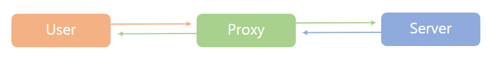

# CORS : 교차 출처 리소스 공유

> Cross-Origin Resource Sharing

- CORS는 서로 다른 출처(Cross-Origin) 간에 리소스를 전달하는 방식을 제어하는 체제이다.

## CORS 관련 이슈

CORS 정책을 위반한 상태로 서로 다른 출처에 리소스를 요청하게 되면 **브라우저가 보안 상의 이유로 차단을 한다.**

즉, CORS 에러 메시지가 뜬다.

</br>

### Acccess-Control-Allow-Origin

요청을 보내는 프론트 주소와 받는 백엔드 주소가 다르면(서로 다른 출처) **CORS 정책 위반**으로 에러가 발생한다. 따라서 서버에서 `Access-Control-Allow-Origin` 헤더에 알맞은 값(프론트 주소)을 세팅해주면 된다.

```ts
app.get("/data", (req, res) => {
  res.header("Access-Control-Allow-Origin", "*");
  res.send(data);
});
```

이때 와일드카드(`*`)를 사용하여 헤더를 세팅하면 모든 출처에서 오는 요청을 받아주겠다는 뜻이기 때문에 편리하지만 보안이 취약해진다. 따라서 이왕이면 출처를 명시해주도록 한다.

하지만 위의 예제처럼 REST API의 모든 응답에 `Access-Control-Allow-Origin` 헤더 값을 세팅해주는 코드를 일일이 추가해 주는 것은 조금 귀찮아 보인다.

이를 위해 이름 있는 백엔드 프레임워크의 경우 CORS 관련 설정을 위한 세팅이나 미들웨어 라이브러리를 제공하고 있다.

```
// node.js의 CORS 미들웨어 install

npm install cors
npm install --save-dev @types/cors
```

```ts
// CORS 미들웨어 사용하기
// 참고 : npm - https://www.npmjs.com/package/cors

import cors from "cors";
import express from "express";

const app = express();

const corsOptions = {
  origin: "http://localhost:3000", // 허락하고자 하는 요청 주소
};

app.use(cors(corsOptions));
```

</br>

여기까지는 백엔드에 간섭할 수 있을 때 해결할 수 있는 정석적인 방법이었다.

어쨌든 CORS 정책을 검사하는 것은 브라우저에서 구현되어 있는 스펙이기 때문에 정책 위반으로 문제를 겪는 건 대부분 프론트엔드 개발자이다. 그렇다면 이런 상황을 가정해볼 수 있다.

만약 외부 API를 사용할 때, 우리는 HTTP 응답 헤더인 `Acccess-Control-Allow-Origin`를 설정할 수 없다. API 서버 쪽에서 조치를 취해주지 않는 이상 말이다.

이때 사용할 수 있는 방법으로 **프록시(Proxy) 서버를 사용해 우회**하는 방법이 있다.

</img><br/>

사용자가 요청을 서버로 바로 전달하지 않고 프록시를 통해 우회하여 전달하는 것이다. 이렇게 되면 프록시와 서버는 서버 간의 통신이기 때문에 CORS 정책에 걸리지 않는다. (앞서 말했듯 CORS 정책을 검사하는 것은 브라우저이다.)

다음은 프론트에서 프록시를 통해 우회하는 방법이다.

</br>

#### 이미 존재하는 프록시 서버 이용하기

```
https://cors-anywhere.herokuapp.com // 프록시 서버
// 요청해야 하는 URL 앞에 프록시 서버 URL을 붙여서 요청
https://cors-anywhere.herokuapp.com/https://tillog.netlify.com
```

위와 같은 프록시 서버를 이용하게 되면 중간에서 요청을 가로채서 HTTP 헤더에 `Acccess-Control-Allow-Origin : *`를 설정해서 응답해준다.

이는 문제를 간단히 해결할 수 있지만 속도가 느리다는 단점이 있다.

</br>

#### package.json에 proxy값을 설정

package.json 에 proxy 값을 설정하여 proxy 기능을 활성화하는 방법이다.

예를 들어 네이버 월요웹툰 페이지를 크롤링하려고 한다.

```ts
axios.get("https://comic.naver.com/webtoon/weekdayList?week=mon", {
  /* ... */
});
```

네이버는 외부 출처이기 때문에 당연히 CORS 정책 위반으로 오류가 난다.

package.json에 다음과 같이 네이버 웹툰("https://comic.naver.com")에 대한 프록시 값을 추가해준다.

```
{
  /* ... */
  "proxy": "https://comic.naver.com"
}
```

그러고 나서 호출할 때 URL의 출처에 해당하는 부분을 지워주면 된다.

```ts
axios.get("/webtoon/weekdayList?week=mon", {
  /* ... */
});
```

이렇게 호출하면 브라우저에서는 로컬로부터 응답을 받아온 것으로 인식하기 때문에 CORS 에러를 해결할 수 있다.

</br>

#### http-proxy-middleware setupProxy.js를 통한 미들웨어 설정

2번의 방법을 `http-proxy-middleware` 라이브러리를 사용해 미들웨어로 만들어 수동 커스터마이징 하는 방법이다.

```
npm install http-proxy-middleware
```

라이브러리 install을 마치면 src 폴더 밑에 `setupProxy.js` 파일을 생성한다. </br>
(TypeScript template CRA(create-react-app)는 따로 지원하지 않는다. 따라서 그냥 src/setupProxy.js로 작성하면 CRA가 알아서 세팅해준다.)

```js
// src/setupProxy.js

const { createProxyMiddleware } = require("http-proxy-middleware");

module.exports = function (app) {
  app.use(
    createProxyMiddleware("/naver", {
      // 프록시를 사용할 path // 즉, /naver를 만나면 target 주소(프록시)를 불러옴
      target: "https://comic.naver.com",
      pathRewrite: {
        "^/naver": "",
      }, // 지우려는 path (실제 path가 /naver로 시작하지 않기 때문)
      changeOrigin: true,
    })
  );
};
```

```ts
app.get("/naver/webtoon/weekdayList?week=mon", (req, res) => {
  /* ... */
});
```

이렇게 관리가 가능하다.
