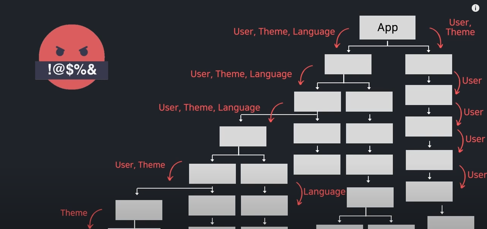

# material-dashboard-react-clone-coding study

## html

- %PUBLIC_URL% : npm run build를 실행하면 CreateReact App이 %Public_URL%을 절대 경로로 대체하므로 클라이언트 측 라우팅을 사용하거나 루트가 아닌 URL에서 호스트를 해도 프로젝트가 작동한다. [source](https://think0wise.tistory.com/21)

- noscript 태그 : 페이지의 스크립트 유형을 지원하지 않거나, 브라우저가 스크립트를 비활성화한 경우 보여줄 HTML 구획을 정의한다. 

### meta 태그

- name="viewport" : 모바일을 포함하여 모든 장치에서 웹 사이트가 잘 보이도록 뷰포트를 설정하는 속성값이다. [source](https://aboooks.tistory.com/352)

- name="theme-color" : 모바일 환경에서 브라우저의 툴바(toolbar)영역의 색상을 바꿀 수 있다. [source](https://www.hahwul.com/2020/01/24/how-to-set-toolbar-color-on-mobile-chrome/)

### link 태그
> link 태그는 해당 문서와 외부 소스(external resource) 사이의 관계를 정의할 때 사용한다. <link> 요소는 빈 태그로 속성만을 포함하며, <head> 요소 내부에만 위치할 수 있다. [source](http://www.tcpschool.com/html-tags/link)

- rel="shortcut icon" : 숏컷 아이콘은 브라우저 탭에서 타이틀 옆에 있는 이미지 아이콘이다. 이를 파비콘(favicon.ico)이라고 한다. [source](https://webdir.tistory.com/337)

- rel="apple-touch-icon" : iOS 2.0 이상과 Android 2.1 이상에서는 터치(Touch) 아이콘 지정이 가능하다. 고해상(152*152)의 파비콘 하나만 준비하면 저해상도에서는 알아서 아이콘의 크기가 변경된다. 

- rel="manifest" : 웹 앱 매니페스트(Web app manifest)는 프로그레시브 웹 앱(PWA)라고 칭하는 웹 기술 모음집의 일부로서, 앱 스토어를 거치지 않고 장치의 홈 화면에 설치할 수 있는 웹사이트를 구성한다. PWA는 사전 다운로드를 통해 오프라인에서도 동작하며 일반적인 Web API도 사용할 수 있다. 웹 앱 매니페스트는 웹 애플리케이션의 정보를 JSON 텍스트 파일로 제공하여, 웹 앱의 다운로드 및 네이티브 앱과 유사한 형태로 제공을 가능케 한다. [source](https://developer.mozilla.org/ko/docs/Web/Manifest)

- rel="stylesheet" : 외부 스타일 시트(external style sheet)와의 연결시 사용한다.

- integrity 옵션 : <link> 태그나 <script> 태그에서 이용 가능하다. 만약 integrity 옵션의 설정값(해시값)과 다르다면 로드되지 않는다.(로드를 차단) 이를 통해 특정 버전의 파일이 변경되거나 변조된 경우를 막아 악의적인 스크립트 변조를 막을 수 있다. [source](https://hi098123.tistory.com/273)

- crossorigin 옵션 : 리소스를 가져올 때 CORS를 사용해야 하는지 나타내는 옵션이다. [source](https://developer.mozilla.org/ko/docs/Web/HTML/Element/link)


## React

### Context

- 리액트 컴포넌트들은 트리 형태로 구성되어 있는데, props를 통해 값을 전달하면 값의 수정이 있을 때 일일이 수정해줘야하는 불편함이 있다. 또한 원하는 컴포넌트에 값을 전달하기 위해 값이 필요 없는 중간 컴포넌트들 까지 props를 받아줘야 한다.(prop Drilling)

</img><br/>

- context는 global state 라고 볼 수 있다. 하지만 context를 사용하면 컴포넌트를 재사용하기 어려워질 수 있기 때문에 단순히 prop drilling을 피하기 위한 목적이라면 컴포넌트 합성(Component Composition)을 먼저 고려하길 권장한다. 

- .displayName = 'string' : context 객체는 displayName문자열 속성을 설정할 수 있다. 이 문자열을 사용해서 context를 어떻게 보여줄 지 결정한다. 이는 개발자 도구에서 지정한 문자열로 표시된다.

### useReducer

  - useState의 대체 함수이다. (state, action) => newState의 형태로 reducer를 받고 dispatch 메서드와 짝의 형태로 현재 state를 반환한다. 
  - 다수의 하윗값을 포함하는 복잡한 정적 로직을 만드는 경우나 다음 state가 이전 state에 의존적인 경우에 보통 useState보다 useReducer를 선호한다.
  - 또한 useReducer는 자세한 업데이트를 트리거 하는 컴포넌트의 성능을 최적화할 수 있게 하는데, 이것은 콜백 대신 dispatch를 전달할 수 있기 때문이다.

### prop-type

- react에서 컴포넌트의 proptypes를 지정하는 방법은 defaultProp와 prop-types 라이브러리를 사용하는 것이다. [source](https://malonmiming.tistory.com/208)

```JS
import PropTypes from 'prop-types';

const MyComponent = ({ name, children }) => {
    return (...);
};

MyComponent.defaultProps = {
    name : '홍길동'
};

MyComponent.propTypes = {
    name : PropTypes.string,
    title : propTypes.number.isRequired // 필수 설정일 때 씀
}
```

### useMemo
> useMemo의 'Memo'는 메모이제이션(Memoization)을 뜻한다.

- useMemo는 useCallback과 더불어 컴포넌트의 성능을 최적화 하기위해 사용한다. 

- 함수형 컴포넌트가 렌더링 된다는 말은 결국 함수 내부의 모든 변수가 초기화 된다는 말이다. 이 경우 useMemo를 사용하면 Memoize 된 값을 재사용 하는 것이 가능하다. 

[source](https://leehwarang.github.io/2020/05/02/useMemo&useCallback.html)

### useLocation

- useLocation hooks는 사용자가 현재 머물러있는 페이지에 대한 정보를 알려주는 hooks이다. [source](https://velog.io/@yiyb0603/React-Router-dom%EC%9D%98-%EC%9C%A0%EC%9A%A9%ED%95%9C-hooks%EB%93%A4)

```JS
const location = useLocation();
console.log(location);
```
- 위의 코드에서 console.log(location)을 실행하면 여러 정보가 나오지만 대표적으로 **pathname과 search**라는 객체가 출력된다. 

- pathname은 링크(/, /home, /xx_page ...) search는 쿼리스트링(?keyword=hello)가 들어간다. [source](https://explain-programming.tistory.com/5)


